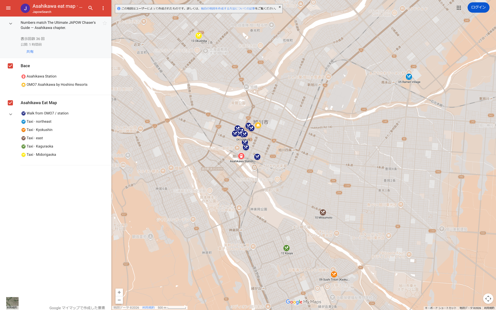
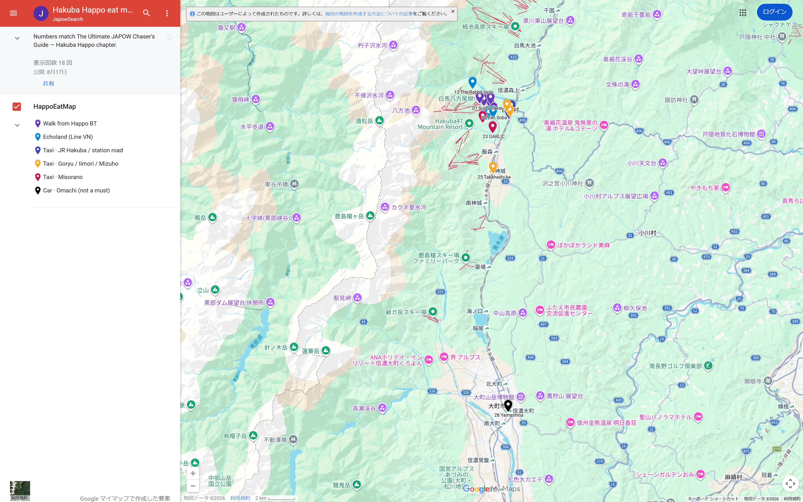
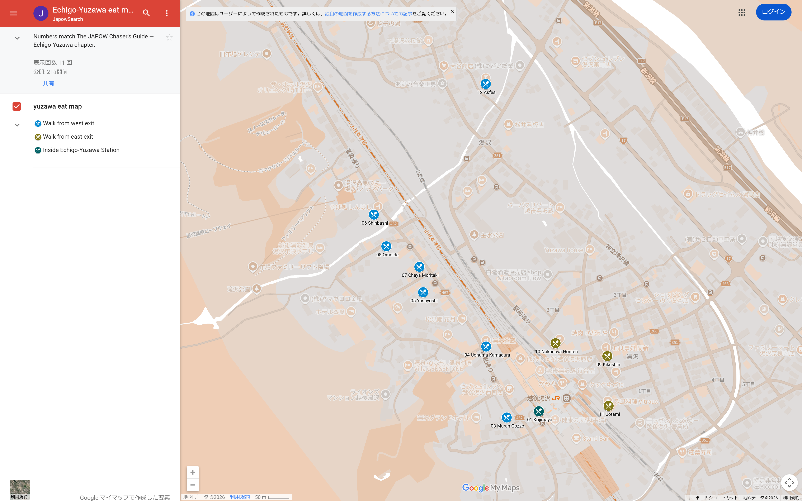

# The Ultimate JAPOW Chaser's Guide
## Best Hubs, Timing & Local Secrets in Japan

**Powered by japowsearch.com**  
**Free updates through May 31, 2027 (2026–27 season)**

---

## Introduction: The Hub Strategy for Powder Hunters

Japan’s powder — Japow — is famous for a reason. What no longer works is booking one mega-resort, riding the same runs all week, and hoping the weather cooperates.

The riders who score the deepest snow move with the weather. One strong base. Several mountains you can reach in a morning. A nightly call from real conditions — not a locked tour.

That is the **Hub Strategy**. This book is the week: when to go, where to sleep, how to move bags without chaos, and the local habits generic travel books skip.

Use **[japowsearch.com](https://japowsearch.com)** every night. This PDF is the plan. Japowsearch is the radar.

This edition covers three hubs: **Asahikawa**, **Hakuba Happo-One**, and **Echigo-Yuzawa**.

### Affiliate disclosure

This guide includes affiliate links (including Discover Cars and the online hotel compare tool). If you book a car or hotel through those links, we may earn a commission—your price does not change.

---

## Section 1: The JAPOW Calendar — Which hub to book

Book **one of these three hubs**. It is not a Japan-wide resort list. Tomorrow’s mountain stays on [japowsearch.com](https://japowsearch.com).

Nothing guarantees deep snow. Timing still raises your odds.

| Window | Book this hub |
|--------|----------------|
| **Early Jan** (1–15) | Storms on; inbound mega-resorts packed. **Echigo-Yuzawa** or **Asahikawa**. Happo is the New Year zoo. |
| **Late Jan · Japanuary** (16–31) | Peak dry powder. **Hakuba Happo-One** or **Asahikawa**. |
| **Early Feb** (1–15) | Base is in; trees open. **Asahikawa** (Kamui / Furano trees). Happo if you want Honshu trees. |
| **Late Feb** (16–28) | Honshu rain risk. **Asahikawa**. Do not lock a Yuzawa or Happo week as your only play. |
| **March** | Bluebird + elevation. **Asahikawa** (Asahidake). Happo ridge on clear days. Yuzawa is the spring-slush risk. |

Two notes that do not fit in a cell:\n\nLate February on Honshu can pick up rain. If that is your only week, book **Asahikawa**. Do not lock Yuzawa or Happo as the only plan.\n\nMarch wants elevation. **Asahidake** from Asahikawa is the dry-snow play. Happo ridge on clear days. Yuzawa is lower — slush is the risk.\n\n*Snowfall charts use Japan Meteorological Agency (JMA) station data. Sources and caveats sit on the graphic.*

---

## HUB 1 — Asahikawa & OMO7

**Season.** Yen figures below are last winter’s published numbers (**2025–26**), unless a newer official page is cited.

**[VERIFY 2026–27]** means next winter is not locked yet. Confirm when that season’s PDF or shop goes live. The tags sit next to the numbers; they are not errors.

### This week in 30 seconds

| | Do this |
|--|---------|
| **Sleep** | Choose once: **OMO7 shuttle week**, **station hotel + buses**, or **rental 4WD**. Seven nights in the **city** — you do not move hubs. |
| **Shape** | **7 nights, one base.** Pilgrimage = **Asahidake** on the first clear/cold window, not a locked Day 3. |
| **Arrive** | Fly **Asahikawa (AKJ)** → airport bus / taxi to OMO7 or the station — **bags ride with you**. Keep boots and a shell on you. |
| **Out** | Same city → **AKJ** (airport bus or taxi with your gear). Do not book a second hub on the last night. **TA-Q-BIN** only if you shipped inbound or want bags waiting at home / the airport. |
| **Days** | Kamui / Asahidake / Furano–Tomamu / Pippu–Canmore / Santa. Pick tomorrow on [japowsearch.com](https://japowsearch.com). |
| **Soak** | Pilgrimage day: **Asahidake Onsen** (Yukoman-so). Other nights: hotel bath or city onsen — tattoo rules differ. |
| **Money (per person, group of 4)** | Beds + local moves: OMO7 shuttle week **~$1,100–1,500** · station + rental 4WD **~$1,000–1,400** · station buses only **~$700–950**. **Not** the week total — lifts, meals, ropeway, guide, TA-Q-BIN extra |

**Do**

- Choose **one** path (OMO7 shuttle / station buses / rental 4WD) before you book beds.
- Book the **Asahidake guide** for January–February as soon as dates lock. Move the day to the first clear/cold window.
- If OMO7: book the **guest shuttle by 22:00** the night before. Seats run out.
- **Optional:** ship heavy bags with **TA-Q-BIN** 1–2 days ahead inside Hokkaido, ~3 from Honshu. Keep boots and a shell if you ship.
- Buy **Kamui / Furano** tickets the night before when the mountain is chosen.
- Carry **cash** for local buses (many do not take Suica).

**Don't**

- Lock Day 2 = Kamui and Day 3 = Asahidake. The weather table wins.
- Treat Asahidake as a casual extra. One ropeway: wind hold = the mountain is closed.
- Skip Asahidake on a station-bus week. The public **Ideyu-go** goes there — it is a clock, not “you cannot go.”
- Put four people, four suitcases, and four board bags in one “standard” 4WD.
- Book Furano as a casual no-car half day (~1.5–2 hr each way on the bus).
- Assume a city hotel bath is Asahidake *kakenagashi*. Do not walk into a **no-tattoo** big bath.

---

If you want one hub that covers big terrain, dry snow, and serious food, **Asahikawa** is the clearest answer in northern Hokkaido.

The reason powder hunters choose it is **Asahidake** — Hokkaido’s highest peak, and Japan’s most serious ropeway-accessed backcountry.

This is not Niseko. There are no chairlifts. One ropeway drops you onto an active volcano. Inland riders call the snow crystal smoke.

In 2017, *National Geographic* ranked Asahi-dake among the world's best powder destinations — a quiet alternative to Niseko ([*In Japan's Northern Wonderland, Winter Is Coming*](https://www.nationalgeographic.com/adventure/article/winter-mountain-snow-asahi-dake-hokkaido), Oct 2017).

Hills you can actually reach from the city are in the reach table later in this chapter. The short version: Kamui and Santa are the week tools. Furano and Tomamu are full days. Asahidake is the pilgrimage.

### Asahidake — why it matters

It is not a resort. One cabin ropeway to about **1,600 m**. No groomed runs. No ski patrol. You are in **Daisetsuzan National Park** on an active volcano with steam vents.

The snow is inland-cold and high. People quote about **14 m** in a season. What matters is how light and cold it stays.

This day is for advanced riders who are honest about avalanche terrain. Beacon, shovel, probe — and a **licensed guide** if Japan’s alpine backcountry is new to you.

Go on a clear, cold, low-wind day. Late January and February are the usual window. Do not go in whiteout near the vents.

After the run, soak. **Asahidake Onsen** is source-spring *kakenagashi* — not a city tub with a mountain name on the tile. Five springs at **Yumoto Yukoman-so**. La Vista’s **Taki-no-Yu**. Finish the day in the water.

> *Build the week around at least one guided day here — and finish it in the spring.*

### Choose the week: shuttle, station buses, or a rental 4WD

One decision. Do not mix. This is a city hub — inn dinner is not a third week type.

**Shuttle week (Path A) — OMO7.** Guest-only free ski buses to Asahidake, Kamui, Pippu, Canmore, and Santa. This is not the public Ideyu-go. Book the seat by **22:00** the night before.

Official 2025–26 Asahidake hotel departures: 7:04 / 9:04 / 12:04. Confirm when the new season page goes live **[VERIFY 2026–27]**. A car is optional — Furano and Tomamu only.

**Station-bus week (Path B).** No OMO7 guest shuttle. You read Japanese timetables yourself. Kamui and Santa run on Dohoku **455**. Pippu is a Dohoku bus, or JR to **Pippu Station** plus the free resort shuttle in season. Furano is a full-day Lavender-go. Asahidake is the public **Ideyu-go** — a clock, not a shuttle. Times and yen sit in the station-bus table below.

**Rental-4WD week (Path C).** Station hotel or OMO7. Shuttles already cover Kamui, Asahidake, Pippu, Canmore, and Santa. A car still wins on clock and range: first chair before the bus, leftover municipal hills, Furano or Tomamu without a full-day coach.

Rent one **4WD** (Discover Cars AKJ or station). Book **studless** tires on the voucher. Check the rubber at pickup.

Split the rental. **The driver does not drink** on nights you drive home from the hill. Drink-driving is a serious crime in Japan.

On arrival you can split the group (Hack 2): luggage on the shuttle, ski gear in the car.

English at the desk: shuttle week uses **OMO Rangers**. Station-bus week: you book the Japanese buses yourself.

### Where to stay: Path A — [Hoshino Resorts OMO7 Asahikawa](https://hoshinoresorts.com/en/hotels/omo7asahikawa/)

OMO7 is built for riders, not just tourists: a free **Wax Bar** (30+ waxes), a proper dry room, in-hotel lift-ticket counter, live mountain cams / daily powder briefings—and the feature most inbound guides underplay: **guest-only free ski shuttles to five local mountains**.

#### Free ski shuttles (hotel guests only — book by 22:00 the night before)

This is why OMO7 works as a hub even **without** a rental car for most of the week. Official winter program (verify each season’s dates/times on the [OMO7 Asahikawa ski page](https://hoshinoresorts.com/ja/hotels/omo7asahikawa/sp/ski/)):

| Destination | Cost | One-way (approx.) | Why it matters |
|-------------|------|-------------------|----------------|
| **Daisetsuzan Asahidake Ropeway** | **Free** | **~90 min** | Pilgrimage BC day without driving yourself; leave early |
| **Kamui Ski Links** (via **Santa Present Park**) | **Free** | **~35–45 min** | High-frequency morning departures; Santa stop for night-ski / warm-up days |
| **Pippu Ski Area** | **Free** | **~30–40 min** | Afternoon *waki-pow* without a car |
| **Canmore Ski Village** | **Free** | **~15–20 min** | Day-1 / local hill option when it runs |
| **Santa Present Park** | **Free** (Kamui route stop) | **~15 min** | Night skiing overlooking the city |

*Shuttle times are road-time estimates—confirm the current timetable on the [OMO7 ski page](https://hoshinoresorts.com/ja/hotels/omo7asahikawa/sp/ski/) before you fly.*

Also in winter: a **free bus to Asahiyama Zoo**—useful on storm / recovery days (penguin walk in season).

**Book the night before.** Seats are limited; cutoff is typically **22:00 the day before** travel. Confirm the season timetable at the front desk or on the official ski page above—times change yearly.

Furano and Tomamu are the days a car still helps. The OMO7 edge is free, hotel-linked buses — especially Asahidake in the morning.

In-house extras: wax bar, dry room, luggage hold, coin laundry.

Use **OMO Rangers** at the front desk when you need help booking local restaurants with a language gap.

#### Path B — station-area beds (when you skip OMO7)

OMO7 is excellent — not mandatory. A station hotel works without a car if you respect winter bus clocks. What you lose is the free hotel shuttle, especially the easy Asahidake morning.

#### Public transport from Asahikawa Station (winter — ride times matter)

These are **one-way** estimates from **JR Asahikawa Station**. Buses run on fixed timetables—not when you want—so check departure times the night before. Source: [Heart of Hokkaido public-transit ski guide](https://taisetsu-kamui.jp/features/24028) **`[VERIFY 2026–27]`**

| Mountain | How | One-way (approx.) | Reality check |
|----------|-----|-------------------|---------------|
| **Santa Present Park** | City bus **455** (Rapid Santa·Links) | **~15–20 min** | Easiest no-car hill; pairs with night skiing |
| **Kamui Ski Links** | Same **455** bus (runs via Santa) | **~35–45 min** | Frequent morning departures from platform **22** |
| **Pippu Ski Area** | **Dohoku Bus** direct from station | **~60–75 min** | Few departures—miss the bus, lose half a day |
| **Pippu Ski Area** | JR to **Pippu (比布) Station** + free resort shuttle (season) | **~45–60 min** | Asahikawa→比布 **15–30 min** (JR) + shuttle **~30 min**; match [official timetables](https://www.town.pippu.hokkaido.jp/ski/access.html) |
| **Furano Ski Resort** | **Lavender-go** sightseeing bus to New Furano Prince Hotel area | **~1.5–2 hr** | **Plan a full day**—you will sit on the bus ~3–4 hr round-trip before lifts |
| **Daisetsuzan Asahidake** | **Ideyu-go** (route 66) year-round, 4/day · station **7:15 / 9:15 / 12:15 / 14:15** → ropeway **9:03 / 11:03 / 14:03 / 16:03** · last down **16:55** · **¥2,300** one-way (fare table 2026-09-01) · or ~75–90 min car / OMO7 guest shuttle | **~75–90 min car** | Public bus exists. It is a **clock**, not a shuttle. Wind hold = the day is dead |

**Cash note:** many local buses do **not** take Suica—carry yen for fares.

**Furano without a car is doable, not casual.** If Furano is a must-do day, either accept **~1.5–2 hr each way on the bus** or rent one **4WD** (~80–90 min drive, flexible departure).

Shortlist near **JR Asahikawa Station** (verify winter rates, parking for a tall 4WD, and gear dry space before you book):

| Hotel | Walk from station | Best for | Ski-relevant notes |
|-------|-------------------|----------|--------------------|
| **[Hotel WBF Grande Asahikawa](https://www.hotelwbf.com/grande-asahikawa/en/)** | ~8–12 min | Closest ski-hotel vibe without OMO7 | Wax bar · Kamui bus tickets at the desk · onsen. Details: [WBF](https://www.ishinhotels.com/wbf/grande-asahikawa/grandeasahikawa-lp) · [Kamui bus](https://www.kamui-skilinks.com/important-information-about-kamui-ski-links-private-bus-en/) |
| **[Hotel Route Inn Grand Asahikawa Ekimae](https://www.route-inn.co.jp/hotel_list/hokkaido/index_hotel_id_635/)** | ~2 min (north exit) | Station + car pickup | Onsen · laundry · easy TA-Q-BIN drop |
| **[KOKO HOTEL Asahikawa Ekimae](https://koko-hotels.com/asahikawa_station/)** | ~2 min | Cheapest true station-front | Laundry · breakfast. **No onsen** |
| **[Dormy Inn Asahikawa](https://dormy-hotels.com/dormyinn/hotels/asahikawa/)** | ~8–10 min | Nightly rooftop onsen | **Kamui no Yu**. **Tattoos: official no** ([spa](https://dormy-hotels.com/dormyinn/hotels/asahikawa/spa)) |
| **[Super Hotel Asahikawa (Daisetsuzan no Yu)](https://www.superhotel.co.jp/s_hotels/asahikawa/)** | ~5 min | Cheapest reliable onsen bed | Station bed for a bus week or a 4WD week. **Tattoos: official no** |
| **[Hotel AMANEK Asahikawa](https://en.amanekhotels.jp/asahikawa/)** | ~3 min (north exit) | Newer station stay | Top-floor bath · ask about dry space |

**Online compare:** this PDF links to a live tool. Enter your dates once and [quote the whole Asahikawa shortlist](https://japowsearch.com/tools/hotel-compare?hub=asahikawa) on one page (Agoda, Booking, and other OTAs). Official hotel links stay in the table — use them if the rate is close, especially **OMO7**.

**How to choose fast**

- Want **shuttle-heavy / car-light** → **OMO7 (shuttle week)** first. Station-bus week if you will read Japanese timetables (Kamui, Santa, Pippu, Furano, Asahidake on **Ideyu-go**).
- Want **lowest room rate** → **Super Hotel**, **KOKO**, or **Route Inn Grand**. Then choose buses or add a 4WD. The hotel is not the week type. The car is.
- Want **onsen every night after trees** → **Dormy Inn** or **WBF** — but if you have **tattoos**, skip those big baths (official no). Plan **Asahidake Onsen** (Yukoman-so day-use, or La Vista **private** baths if you overnight the mountain).
- Book **twins / triples early** for January–February; singles are easy, group rooms disappear first.

### If those are gone

Stay inside a **short walk of JR Asahikawa Station** (or keep OMO7). Search the [live hotel compare](https://japowsearch.com/tools/hotel-compare?hub=asahikawa) for your dates. Do not move the bed to Furano or Asahidake village for the whole week — that is a different trip (you lose the hub).

---

## Section 3: How you get here (and the rental-car trap)

The classic inbound mistake: four people, four suitcases, four board bags, one “standard” 4WD. It will not fit.

**Plan A — fly Asahikawa (AKJ), ride into the city.**  
Land at **Asahikawa Airport**. Take the **airport bus to JR Asahikawa Station**, then walk or taxi to OMO7 or a station hotel. **Bags ride the bus** — TA-Q-BIN is optional (Hack 1).

The bus is about **~35–40 min**. Adult fare **¥750** one-way (Asahikawa Denkikido Route 77; child half). Check the flight-linked timetable the night before. A taxi into town is faster and dearer; split four ways it can beat waiting in a storm.

Path A (OMO7): confirm whether the hotel still runs an airport pickup that season. Do not assume the ski shuttle is the airport bus.

**Plan B — only if AKJ is a bad connection.** Fly **New Chitose (CTS)** and rail/bus north to Asahikawa (allow **~2–3 hr** plus bag chaos). This is not a cheaper Plan A. Use it when the AKJ flight does not exist for your dates.

**Ski bags — optional:** ride the airport bus / taxi with your gear, or ship airport or previous hotel → front desk with **TA-Q-BIN** when the load is too heavy. Keep boots and a shell if you ship. Fair weather inside Hokkaido is often **next day**; storms **2–3 days**. Ask the counter which arrival day they are quoting.

**If you stay at OMO7 (Path A):** you can run **Kamui / Asahidake / Pippu–Canmore / Santa** on the free guest shuttles.

Rent a car only for Furano/Tomamu — or skip the car entirely on a shuttle-only week. Still book early if you want the Path C 4WD option.

### Hack 1: TA-Q-BIN (optional luggage forwarding)

Use this when the load is too heavy for the airport bus, or you want hands-free travel. Ship heavy suitcases ahead to OMO7 (or your hotel) from the airport or a previous hotel via Yamato Transport (**TA-Q-BIN**).

- From Honshu (Tokyo / Kyoto, etc.): send **about 3 days** ahead.
- From within Hokkaido: **1–2 days** is usually enough.

Confirm cutoff times and winter delays with Yamato for your exact route.

### Hack 2: Arrival timing and 4WD booking

Land with daylight: ski. Land after dark: nighter or a bath.

In Hokkaido winter, assume **4WD + studless tires**. Cars sell out early. A rental-4WD week **replaces** “we will figure out buses.” It is not an extra on top of a full OMO7 shuttle week unless you only need the car for Furano or Tomamu.

**Option A — Morning / midday arrival (“Split & Strike”)**  
Split the group. Two people take heavy luggage on the airport shuttle to OMO7. Two pick up the rental car with snow gear only and drive to **Canmore Ski Village** (~15 min) for a Day-1 session.

→ [Book 4WD from Asahikawa Airport (AKJ)](https://www.discovercars.com/japan/asahikawa/akj?a_aid=Jaapowsearch)

**Option B — Afternoon / evening arrival (“Night Rider”)**  
Skip the airport car. Shuttle together to OMO7, drop bags, then pick up a car near **Asahikawa Station** (short walk from the hotel area).

Drive ~15 min to **Santa Present Park** for night skiing. Check seasonal hours — **16:00–21:00** (official 2025–26; center lift to 21:00) **[VERIFY 2026–27]**.

→ [Book 4WD near OMO7 / Asahikawa Station](https://www.discovercars.com/japan/asahikawa/asahikawa-railway-station?a_aid=Jaapowsearch)

---

## Section 4: 7 nights (weather table wins)

Bookmark **[japowsearch.com](https://japowsearch.com)**. The week table is a **quiet-week fallback**, not a tour. The weather table wins.

### Tonight (every night except the last)

1. Open japowsearch — **Kamui / Asahidake / Furano / Tomamu / Pippu / Canmore / Santa**.
2. Check **wind, new snow, and temperature**—not just “is it snowing.” Whiteout + volcano = not Asahidake.
3. Pick tomorrow with the weather table. Shuttle week: book the **OMO7 bus by 22:00**. Station-bus week: screenshot the clock. 4WD week: studless, parked, no drinks if you drive.
4. If tomorrow is **Asahidake**, the guide day is already booked — only **move the date** with the operator if the window is wrong. Do not DIY the alpine.

| If tonight looks like… | Go tomorrow |
|------------------------|-------------|
| New snow + trees friendly | **Kamui** |
| Bitter cold + clear / stable | **Asahidake** (guide for real BC). This is the pilgrimage window — take it even if it is Day 2 or Day 6. |
| Weekend crowds / tracked mega-resorts | **Pippu** or **Canmore** (waki-pow) |
| High wind / ropeway-hold risk | **Not Asahidake.** One ropeway — if it stops, there is nothing to ski. **Kamui / Santa / Canmore** or city recovery |
| No new snow / lean week | **Santa** or **Canmore** groomers (Kamui if the park is the product). Do not drive to Asahidake hoping for leftover powder |
| Arrival night only | **Santa Present Park** (if you land with time) or skip |
| Furano / Tomamu only if | You accepted the **full day** (bus ~1.5–2 hr each way, or Path C drive). Not a filler morning. |

Days 2–6 are **not** Kamui → Asahidake → Furano. Asahidake is the first **clear, cold, low-wind** window after you arrive. **Do not go in a storm, and do not go on a windy day** — the ropeway is the only lift.

**Lights / storm — not the same product.**

| Option | When | From the city | Notes |
|--------|------|---------------|--------|
| **Santa Present Park** nighter | In season, **16:00–21:00** (official 2025–26) **[VERIFY 2026–27]** | ~15 min (bus 455 / OMO7 shuttle / car) | Warm-up and last-day laps. Not BC. |
| **Asahiyama Zoo** | Storm / recovery | OMO7 guest bus (free in winter) or city bus | Penguin walk in season. |
| **City onsen** | Any night you did not go to Asahidake | Walk / short taxi | Tattoo: Dormy / Super Hotel **official no**. Yukoman-so = pilgrimage day. |

Evening jobs are scarce. **Do not** stack a big Genghis Khan booking and a nighter on the night you land or the night you pack.

| | Daytime | Evening — one job |
|--|---------|-------------------|
| **1 · Arrive** | Fly in. **Canmore** only if you land with daylight and split the 4WD. After dark: bags + a hotel bath. | Easy food near the station. **No** Asahidake. |
| **2 · City hub** | Weather table. If the night is quiet: **Kamui**. | Station dinner (Daikokuya if booked). |
| **3 · City hub** | Weather table. Clear, cold, guide on: **Asahidake**. Else Kamui or Pippu. | Early if you rode the volcano + Yukoman-so. |
| **4 · City hub** | Weather table. If everything is held: zoo or the city. | Easy food. |
| **5 · City hub** | Weather table. **Furano** only as a full day. | Station izakaya. |
| **6 · City hub** | Weather table. Leftover local: **Pippu / Canmore**. | Pack soft bags. |
| **7 · Out** | Santa only if the clock is real. Then **airport bus / taxi to AKJ** with your gear. (If you shipped home on TA-Q-BIN, bags are already gone.) | — |

---

## Section 5: Asahikawa Food — TOP3 by Category

Tonight: ramen or lamb. Pick one shop. The numbered table is the only list.

Web seats (Toreta / Hot Pepper / EPARK) are mostly Japanese. Translate, ask **OMO Rangers**, or call. Hours live on Maps. Season links: **[VERIFY 2026–27]**.

### City food — numbered pins 01–17

On foot from **OMO7** or **JR Asahikawa Station**, or a short city taxi. **05 Ramen Village**, **09 Triton** (Kyokushin), **10 Mitsumoto**, **12 Kouya** (Kaguraoka), and **13 Okushiba** are **taxi / car** — not the station stroll. No Furano dinner run.

| # | Go here | For | Book |
|---|---------|-----|------|
| **01** | **Santouka** (head office) | Ramen must. Queue. | Walk-in · closed Thu · [Official](https://www.santouka.co.jp/shop-jp/hokkaido/area01-001) · [Maps](https://maps.google.com/?q=43.7647514,142.3600012) |
| **02** | **Baikohken** (head office) | Classic Asahikawa ramen | Walk-in · [Official](https://h074500.gorp.jp/) · [Maps](https://maps.google.com/?q=43.7650476,142.3615878) |
| **03** | **Hachiya Gojo** | Roasted-lard ramen. 5-7 Alley. | Walk-in · [5·7 Alley](https://furari-to.net/shop/s_14.html) · [Maps](https://maps.google.com/?q=43.762456,142.364512) |
| **04** | **Ichikura** | Late-night ramen. Confirm hours. | Walk-in · no web seats · [Maps](https://maps.google.com/?q=43.765234,142.362891) |
| **05** | **Ramen Village** | Group sampler. **Taxi** ~15 min | No group booking · queue · [Maps](https://maps.google.com/?q=43.729845,142.414567) |
| **06** | **Daikokuya** | Lamb BBQ (Genghis Khan). Book. | [Toreta](https://yoyaku.toreta.in/daikokuya-honten/) · [Maps](https://maps.google.com/?q=43.763433,142.363819) |
| **07** | **Taisetsu Ji-Beer Kan** | Lamb + beer, warehouse. Closed Sun | [Hot Pepper](https://www.hotpepper.jp/strJ004004001/yoyaku/) · [Maps](https://maps.google.com/?q=43.765867,142.358119) |
| **08** | **Hitsujiya** | Easier Genghis Khan. Book peak. | [Hot Pepper](https://www.hotpepper.jp/strJ001160888/) · [Maps](https://maps.google.com/?q=43.764725,142.362891) |
| **09** | **Sushi Triton (Kyokushin)** | Conveyor / groups. **Taxi** | Walk-in only · [Store](https://toriton-kita1.jp/shop/kyokushin/) · [Maps](https://maps.google.com/?q=43.728592,142.348011) |
| **10** | **Mitsumoto** | Seafood-bowl lunch. **Taxi** east | Phone peak · 0166-33-6677 · [Maps](https://maps.google.com/?q=43.755089,142.378614) |
| **11** | **Konishi Sushi** | Sit-down sushi dinner | [Official reserve](https://konishisushi.com/contact/) · 0166-22-4443 · [Maps](https://maps.google.com/?q=43.765167,142.362398) |
| **12** | **Kouya (Kaguraoka)** | Soup curry. **Taxi** | Walk-in · closed Tue/Wed · [Maps](https://maps.google.com/?q=43.740701,142.3735135) · 0166-66-8120 |
| **13** | **Okushiba Asahikawa-tei** | Shrimp soup curry + Genghis. **Taxi** | Phone weekends · 0166-51-1100 · [Official](https://okushiba.net/asahikawa/) · [Maps](https://maps.google.com/?q=43.748912,142.365234) |
| **14** | **Gin-neko** | Shinkoyaki. Go early. Closed Mon | Walk-in · [Official](https://www.ginneko.co.jp/) · [Maps](https://maps.google.com/?q=43.762912,142.365034) |
| **15** | **Sanshiro** | Historic izakaya | Phone Tue–Sat 16:00–21:00 · 0166-22-6751 · [Maps](https://maps.google.com/?q=43.766089,142.361712) |
| **16** | **Sumiya Asahikawa** | Salt *horumon*. Phone only | 0166-26-4303 · [Tabelog](https://tabelog.com/hokkaido/A0104/A010401/1000111/) · [Maps](https://maps.google.com/?q=43.763891,142.364123) |
| **17** | **Coffee Tei Tirol** | Café since 1939 | Phone / email · [Official](https://cafe-tirol.com/shop.html) · [Maps](https://maps.google.com/?q=43.765812,142.361234) |

**Map:** [Asahikawa eat map](https://www.google.com/maps/d/viewer?mid=1H9fAIBhcInblW99U2jBObN4dOxJ_2G4). Same numbers as the table. Taxi: **05**, **09**, **10**, **12**, **13**.

### Tonight, in English

**Ramen.** Locals queue for **01 Santouka** *shio* — closed Thursday. **02 Baikohken** looks heavy and eats lighter. **03 Hachiya** is the roasted-lard alley shop since 1947. Late: **04 Ichikura**. A group that wants a sampler takes a taxi to **05 Ramen Village** (~15 min). No seats booked at any of these.

**Lamb.** You grill it yourself. The sauce is a house taste — do not drown the meat. **06 Daikokuya** is the booking: first seating ~17:00 on [Toreta](https://yoyaku.toreta.in/daikokuya-honten/). Later: [EPARK](https://epark.jp/shopinfo/jsp617687/). **07 Taisetsu Ji-Beer Kan** is lamb plus beer in a warehouse; closed Sunday; [Hot Pepper](https://www.hotpepper.jp/strJ004004001/yoyaku/). **08 Hitsujiya** is the easier first grill; winter seats on [Hot Pepper](https://www.hotpepper.jp/strJ001160888/).

**Fish.** **09 Triton** (Kyokushin) is conveyor Hokkaido — scallop, ikura, botan shrimp — walk-in, taxi, [store page](https://toriton-kita1.jp/shop/kyokushin/). **10 Mitsumoto** is the seafood-bowl lunch; phone 0166-33-6677; taxi east. **11 Konishi** is sit-down sushi and sake; book [the official form](https://konishisushi.com/contact/) or 0166-22-4443.

**Soup curry and night food.** **12 Kouya** is the specialist — ticket machine, kaffir-lime lift, closed Tue/Wed, taxi, 0166-66-8120. **13 Okushiba** is shrimp-broth curry and also lamb; weekends: 0166-51-1100. **14 Gin-neko** is half-roast chicken; go early; closed Monday. **15 Sanshiro** is the 1946 izakaya — phone Tue–Sat 16:00–21:00, 0166-22-6751. **16 Sumiya** is salt *horumon* two minutes from the station, not a far pin: 0166-26-4303. **17 Tirol** has been coffee since 1939.

### Slope food is insurance

Eat in town at night. On the hill: **Kamui** has **NOBu** ramen. **Asahidake** lunch is **La Vista** raclette or **Yukoman-so** — not cheap; [La Vista](https://dormy-hotels.com/resort/hotels/la_daisetsuzan/) or 0166-97-2323. **Canmore:** Alberta *zangi* bowl. **Santa:** Yamaokaya if you land late. **Pippu:** Yukibanya trout-ikura bowl if it is on.

---

## Section 6: Local Secrets for JAPOW Chasers

### 1. The afternoon powder hack (*waki-pow*)

Everyone sprints to mega-resorts for first tracks. Locals often do the opposite.

Crowd gravity pulls inbound riders toward **Furano**. **Canmore** and **Pippu** stay quieter. Side hits (*waki*) last into the afternoon.

Check japowsearch first. If the big names look tracked or packed, pivot to the locals.

### 2. Soak after the hill (volcanic kakenagashi — do not skip)

Inbound itineraries treat Asahikawa as “a city with a hotel onsen.” That undersells it. The same volcano you rode in the morning feeds **Asahidake Onsen**—**source-spring kakenagashi**, not a downtown tub with a mountain name on the tile.

**Yumoto Yukoman-so** ([yukoman.jp](https://www.yukoman.jp/)) runs **five private springs, 100% kakenagashi** (no recirculation / chlorine on the main baths). Day-use is the annex **Kamigami-no-Yu**: **¥1,200** adult · **¥600** child; reception **12:00–18:00**; phone 0166-97-2101. This is the soak that matches the pilgrimage day. Build 60–90 minutes into the Asahidake shuttle plan so you are not staring at a closed door.

**La Vista Daisetsuzan** uses **Asahidake Onsen (Taki-no-Yu)**—official **kakenagashi** ([hotspring page](https://dormy-hotels.com/resort/hotels/la_daisetsuzan/hotspring/)). Day-use is **not** offered. Overnight guests get three **free private baths** (no reservation; walk in if vacant).

City hotels still matter for a nightly rinse: Dormy Inn’s rooftop **Kamui no Yu** and Super Hotel’s **Daisetsuzan no Yu** are natural hot-spring baths in town. They are convenient. They are **not** the volcanic village soak.

#### Tattoos — be exact, then be polite

| Bath | Kakenagashi? | Tattoos | Notes |
|------|----------------|---------|--------|
| **Yukoman-so** (Asahidake village) | **Yes — five springs, 100%** | **Ask.** No published ban; inbound hikers/skiers are common. Do not assume. | Best “real spring” day-use. Confirm before you go. |
| **La Vista Daisetsuzan** | **Yes** (seasonal heating/dilution possible) | **Communal: no. Private kashikiri: yes** (official FAQ) | Tattooed guests: skip the big bath; use **Shumari-no-Yu** private rooms. |
| **Dormy Inn Asahikawa · Kamui no Yu** | Natural spring (pumped city well), rooftop | **Official no** | [Spa page](https://dormy-hotels.com/dormyinn/hotels/asahikawa/spa) |
| **Super Hotel · Daisetsuzan no Yu** | Natural onsen (city) | **Official no** (chain house rules) | [Yakkan](https://www.superhotel.co.jp/topct/yakkan.html) |

If staff ask you to leave a non-tattoo bath, leave. Covers help only if the house says so. Large ink: **private bath or Yukoman-so after you have asked**.

### 3. Gear trouble: Spray166

Need a fat board or a binding that failed on Kamui? **Spray166** is the snowboard shop locals actually use — deep rental quiver, real repair bench. Ask if someone on the floor speaks English that day; winter hours close earlier than the city restaurants.

### 4. Izakaya survival + OMO Rangers

- **Otoshi:** A small appetizer you did not order (~¥500–¥800). It is a normal table charge—not a scam. Eat it.
- **No tipping.** Pay the bill as written.
- **Language gap:** Ask **OMO Rangers** at OMO7 for booking help on quieter local spots. Pair that with japowsearch for the mountain side of the day.

### 5. Quick decision rules (Asahikawa hub)

Use the **Section 4 weather table** (including wind hold and the lean-week row). Do not keep a second, weaker copy here.

---

## Section 7: Backcountry & Sidecountry — Asahidake & Beyond

Asahidake and other alpine zones are not “extra groomers.” They are **unpatrolled mountain environments** inside a national park.

### Before you go

- Hire a **licensed guide** for Asahidake unless you already know Daisetsuzan terrain and current avy conditions.
- Carry beacon / shovel / probe and know how to use them.
- Confirm travel insurance covers **off-piste / backcountry** in Japan.
- Do not ride in whiteout conditions near volcanic vents—you can lose visibility and terrain reference fast.

### Recommended guides from Asahikawa (researched 2026)

Book **January–February** early. **Ropeway tickets** (not resort lift passes) and touring gear are often **not** included in guide fees.

| Operator | Best for | Why inbound riders like them | Indicative price (per group) | Book |
|----------|----------|------------------------------|------------------|------|
| **Yabai Tours** | **Asahidake ropeway-assisted BC** (minimal hiking) | Asahikawa-based locals; English/Japanese; specialize in ropeway-access powder laps. Many routes need only a short bootpack—no skins required on ropeway-assisted days. | **~¥125,000–140,000 / group / day** (up to 3 pax) **[VERIFY 2026–27]** | [yabaitours.com/asahidake-backcountry-tour](https://yabaitours.com/asahidake-backcountry-tour) |
| **Rising Sun Guides** | Full **ski/split touring** in Daisetsuzan | Registered Japan travel agent; **door-to-door pickup** from Asahikawa/Higashikawa; flexible daily destination (Asahidake, Kurodake, Tokachidake) based on conditions. Max ~6:1 guest-to-guide. | **Private / group / day:** **¥149,000** (1–3 pax) / **¥179,000** (4–5) / **¥204,000** (6). Tax incl. Gear extra. Groups of 7+ need 2 guides. **[VERIFY 2026–27]** | [risingsunguides.com — Central Hokkaido](https://risingsunguides.com/backcountry-touring/central-hokkaido-backcountry-touring/) |
| **Deeper Mountain Guide Hokkaido** | Private groups wanting a **simple flat-rate day** | English booking; Asahidake / Furano-dake day tours from Asahikawa area. Gear often extra. | **¥100,000 / group / day** (1 pax) / **¥120,000** (2–3) / **¥150,000** (4–6) **[VERIFY 2026–27]** | [deeperhokkaido.com/english](https://deeperhokkaido.com/english/) |

**Our pick for first-time Asahidake visitors:** **Yabai Tours** if you want maximum riding with a short bootpack off the ropeway. **Rising Sun Guides** if you want a fuller touring day with hotel pickup.

### Sidecountry (resort-adjacent—not Asahidake)

| Zone | Notes |
|------|-------|
| **Kamui Ski Links** | Strong tree and side-hit terrain; stay inside resort rules |
| **Santa Present Park** | City-side local hill (~15 min); night skiing; easy warm-up / last-day laps—not BC, but respect closures |
| **Pippu / Canmore** | Afternoon *waki-pow*—not BC, but respect closures |

---

## Section 8: What it costs (per person, group of 4)

**¥150 ≈ $1.** This is **beds + the city-side moves on that path** — not an all-in week. Lift passes, Asahidake **ropeway**, meals, TA-Q-BIN, fuel, and **one guided BC day** are extra.

| Path | Stay | Transport | Beds + local moves |
|------|------|-----------|---------------------|
| **A — OMO7 shuttle week** | OMO7 | Guest shuttles; optional 4WD only for Furano/Tomamu | **~$1,100–1,500** |
| **B — station buses only** | Super Hotel / KOKO / Route Inn Grand | Airport bus + city / Dohoku / Lavender-go. Asahidake = **Ideyu-go** (paid, four clocks) | **~$700–950** |
| **C — station + rental 4WD** | Super Hotel / KOKO / Route Inn Grand / Dormy / AMANEK / WBF | Rental 4WD (Discover Cars AKJ or station) | **~$1,000–1,400** |

Peak January weeks move the room line. Path A is not “Premium” — it is the shuttle machine. Path B is cheaper because you dropped the guest shuttle, not because Asahidake is impossible. Super Hotel is a **station bed**: run it as Path B or add a 4WD and it becomes Path C.

A fillable budget sheet link will sit on the Gumroad post-purchase page (not as a second PDF).

---

## Book this

You already chose Path A, B, or C. Do not re-pick here.

- **August** (or when 2026–27 winter inventory opens): beds on that path (OMO7 **or** a named station hotel). Book an Asahidake **guide** (Yabai / Rising Sun / Deeper) for a movable day. Book AKJ flights.
- **90 days out:** remaining twins or triples. Path C: 4WD if that is the path (**studless** on the voucher). Daikokuya / Konishi if those dinners matter.
- **30 days out:** TA-Q-BIN plan. Remaining web books. Path A: tell OMO7 you want ski shuttles.
- **14–7 days out:** [japowsearch](https://japowsearch.com) sketch. Confirm the Asahidake window with the guide (move the day if the volcano is in cloud). Path A: know the **22:00** shuttle cutoff. Reconfirm the airport bus clock **[VERIFY 2026–27]**.

---

## HUB 2 — Hakuba Happo-One

This hub is **Happo Bus Terminal**, not Nagano Station. The week is **Happo ~5 nights + Nozawa Onsen ~2 nights** — you move; you do not day-trip.

**Season.** Yen figures below are last winter’s published numbers (**2025–26**), unless a newer official page is cited.

**[VERIFY 2026–27]** means next winter is not locked yet. Confirm when that season’s PDF or shop goes live. The tags sit next to the numbers; they are not errors.

### This week in 30 seconds

| | Do this |
|--|---------|
| **Sleep** | Choose once: **Eat out** or **Inn dinner**. Happo: **10-minute walk** of Happo BT. Nozawa: village core (Chuo / Ōyu). |
| **Shape** | **~5 nights Happo + ~2 nights Nozawa Onsen** — you *move*, you do not day-trip |
| **Arrive** | Narita or Haneda → **Nagano Snow Shuttle** → Happo BT → walk |
| **Out** | NSS from **Nozawa Chuo** → Haneda or Narita. **Do not go back to Happo.** |
| **Days** | Ski the valley. Soak. Decide tomorrow on [japowsearch.com](https://japowsearch.com) |
| **Soak** | **Happo-no-Yu** after the hill — high-alkaline municipal, tattoo OK. Nozawa: soto-yu. |
| **Money (per person, group of 4)** | Beds + airport coaches: Inn dinner / Moegi–Panorama **~$1,600–$2,200** · Eat out at THE HAPPO **$2,800–$3,500**. **Not** the week total — lifts, meals, Happo→Nozawa, bags extra |

**Do**

- Choose **Eat out** or **Inn dinner** once. Book Happo and Nozawa on that path.
- Book the airport shuttle to Happo BT, not to Nagano Station.
- Book the **outbound** NSS from **Nozawa Chuo** the same week you book inbound. The coach does not wait for your flight.
- Eat out: book one Happo-walk dinner and, if you want the loud night, **Hie** in Echoland with a way home.
- After the hill: **Happo-no-Yu** (municipal, tattoo OK).
- Buy the Hakuba Valley lift ticket **online the night before**.

**Don’t**

- Mix the paths: inn-dinner rates include dinner. Do not book them as the default if every night is drinks out — or **ask the inn** to skip dinner.
- Sleep in Nagano city and “day-trip Hakuba.”
- Sleep in Echoland or Wadano — too far from Happo BT for the 8 a.m. valley buses.
- Day-trip Nozawa from Happo.
- Go back to Happo for the airport bus. Fly out from **Nozawa Chuo**.
- Book a tight flight after the Nozawa coach. Highway snow can add an hour or stop the bus.
- Drive without **studless tires (スタッドレス)** — 4WD is not enough.
- Arrive by car without a **reserved hotel parking space** (Happo and Nozawa).
- Drink and drive. In Japan that is a **serious crime**.

---

### Why this week — Happo BT, then move

Hakuba Valley is a **major inbound name**, so it draws a crowd. Powder mornings here track out faster than on a quiet local hill.

What still outweighs that is simple: several mountains you can rotate without a car, a municipal soak after the lifts, a walkable village night, and one bus knot that holds a car-free week together.

This chapter is for a week of skiing, a soak, and nights out.

Ride the valley by day. **Happo-no-Yu** (or Sato-no-Yu on a winter evening) after the lifts. Sleep at **Happo Bus Terminal** — not Nagano Station, and not a quiet hotel that is perfect at 8 a.m. and empty at 8 p.m.

Stay inside about a **10-minute walk** of Happo BT. Echoland is the louder night; Wadano is quieter. Treat either as an evening, not as the bed you need for the morning shuttle.

Happo is a strong hub, which is why the first stretch belongs here. Then you **move**. **Nozawa Onsen** is also famous. If you have never stayed in that village, go—even though it is a major name too. A seven-day trip in this report is **Happo ~5 nights + Nozawa ~2 nights**. Happo-One is the home port. Nozawa is Act 2. Sleep in the **village core** (Chuo BT / Ōyu) — not Nagasaka ski-in, not Nakao.

Stay next to **Happo Bus Terminal**. The airport coach is the **Nagano Snow Shuttle**. Daytime valley buses are free on the Hakuba Valley network.

| Mountain | How (from Happo BT) | Why go |
|----------|---------------------|--------|
| **Happo-One** | Walk, or free HV Line H / E | Home hill. Big vertical. Ridge wind-holds. **No nighter.** |
| **Iwatake** | Free HV · ~15 min | Weekday trees / leftover afternoon powder (*waki-pow*) |
| **Hakuba 47 / Goryu** | Free HV south (watch the link in wind) | Linked domain. Lean-snow: **Goryu Waves**. Night lights: **Toomi**. |
| **Tsugaike** | Free HV Line T | Acreage. **DBD trees:** watch the lecture video *tonight* — not at the gate. |
| **Cortina / Norikura** | **Paid HV Line V** unless you have an HV pass | Deep trees. Not a free hop. |
| **Nozawa Onsen** | NSS inter-resort (not the valley shuttle) | Act 2 — two nights, not a day trip. |

**Wind:** Happo ridge gondolas and the 47–Goryu link shut in strong wind. Pick tomorrow’s hill every night on [japowsearch](https://japowsearch.com).

### Happo-One — why it matters

The mountain you sleep under is the hub, not every day’s hill.

Happo-One is a patrolled resort with chairs and a gondola. The week is the **valley circuit from Happo Bus Terminal**, plus one **guided** day when the snowpack and sky allow.

Honshu storms plus alpine wind. Ridge gondolas and the 47–Goryu link hold. Powder mornings track out faster than a quiet Hokkaido local. That is why you rotate — Iwatake leftover, Tsugaike trees, Cortina — instead of repeating Happo frontside.

Go to the ridge on the first bluebird after a dump, if those lifts open. Deep plus high wind: **Tsugaike**, not the ridge.

After the run: **Happo-no-Yu** (municipal, tattoo OK). Ski, soak, dinner.

> *Ski the valley from Happo BT; then move to Nozawa for two nights. The week is the pilgrimage—not a single mountain.*

---

### Choose the week: eat out, or dinner at the inn

One decision. Both hubs follow it. English desk needed → **Eat out** (THE HAPPO). Not a third path.

### Eat out

Dinner is not in the room rate. The Eat lists below are the week’s job.

**Happo** — still a **10-minute walk** of Happo BT.

| Stay | Walk | Why this one | Shared hotel bath | Book |
|------|------|--------------|-------------------|------|
| **THE HAPPO** | ~3 min | Eat out every night. English desk. One knot for airport, valley, Nozawa bus. | **Yes** — ask desk | [the-happo.com](https://the-happo.com/) |
| **Hakuba Moegi HOTEL** | ~8 min (Adam gondola ~2–3 min) | Ski-access first. 10 rooms. | **No** — soak at Happo-no-Yu | [hotelmoegi.com](https://www.hotelmoegi.com/) · [489ban](https://reserve.489ban.net/client/hakuba-hotelmoegi/4/plan) |
| **Hakuba Panorama Hotel** | ~5 min | Standard + **Taproom** downstairs. Free winter shuttle from Happo BT on request. | **Yes** — ask desk | [tenguproperties.com](https://tenguproperties.com/hakuba-panorama-hotel/) |

Hotel shared baths: house tattoo rule is **not on the hotel sites** — ask the desk. Need a published yes? Walk to **Happo-no-Yu** (municipal, tattoo OK). Winter rates are date-driven. Round 2 band for THE HAPPO: **¥60,000–¥110,000+ / night** (twin)—a band, not a rack. Moegi / Panorama: enter dates on the official engine. **[VERIFY 2026–27]**

**Online compare:** enter your dates once and [quote the Happo BT shortlist](https://japowsearch.com/tools/hotel-compare?hub=hakuba) on one page (Agoda, Booking, Trip.com where listed). Official hotel links stay in the table — use them if the rate is close, especially **Maruishi** and **Shiroumaso** ryokan plans.

**Nozawa** — village core. Room-only. Soto-yu for the soak.

| Stay | Why | Tattoo | Book |
|------|-----|--------|------|
| **Winterland Lodge** | **30 seconds from Chuo BT.** 6 rooms. Peak is gone by summer. Check their room calendar, not OTAs. | No hotel bath. **Yokochi-no-yu** = soto-yu (**tattoo OK**) | [winterlandlodge.com](https://winterlandlodge.com/) |
| **Residence Yasushi** | Western beds + village walk. English desk. Direct / agent — not Booking.com. Baths are **reserved private** (desk). | Reserved slot = your party | [residenceyasushi.com](https://residenceyasushi.com/) |
| **mont** | 14 rooms, 1–2 min from the Liner. Shower + soto-yu kit. | **No hotel bath** | [mont-nozawaonsen.com/en](https://mont-nozawaonsen.com/en/) |

### Inn dinner

Dinner is in the rate. That is the point.

Walk-out nights: **ask the inn** to skip dinner (room-only / no-dinner) before you book, or at check-in. Do not assume the OTA already did that. Eat lists = those skip-dinner nights only.

**Happo** — still a **10-minute walk** of Happo BT. These two will not show on Booking.com. English book is **Trip.com**. Confirm dinner is on the plan.

Japanese: happo.jp / shiroumaso.com / phone.

| Stay | Walk | Why this one | Shared hotel bath | Book |
|------|------|--------------|-------------------|------|
| **Maruishi** | ~5 min | Inn Japanese dinner. Local. Official kakenagashi. Almost no English. | **Yes** — flow-through. Tattoo: **ask inn**. Reserved tatami bath **¥2,100 / hr** | [Trip.com](https://www.trip.com/hotels/hakuba-hotel-detail-17452890/hakuba-happo-onsen-maruishi/) · [happo.jp](http://www.happo.jp/) · **0261-72-2116** |
| **Shiroumaso** | ~2 min (official) | Inn Japanese dinner. Local food. Village listing: Happo Onsen **kakenagashi**. | **Yes**. Tattoo: **ask inn**. | [Trip.com](https://www.trip.com/hotels/hakuba-hotel-detail-705790/hakuba-onsen-ryokan-shirouma-so/) · [shiroumaso.com](https://shiroumaso.com/) · **0261-72-2121** |

Maruishi winter: **no hotel shuttle** (you walk). This guide’s call: dinner here will usually beat the tourist-menu rooms around Happo BT.

**Nozawa** — village core. Own site / phone. Confirm dinner is on the plan. No TripAdvisor.

| Stay | Why | Tattoo | Book |
|------|-----|--------|------|
| **Kiriya** | Full ryokan. Cats. Some rooms without an ensuite shower. English at the desk. | **Ask inn** | [kiriya.jp/eng](https://kiriya.jp/eng) · **0269-85-2020** |
| **Kawaichiya** | 20 rooms. Cash. Winter after 15 Dec = website only. **Shinano-tei** rooms = Shin-yu in the room. | Shared: **ask inn** | [kawaichiya.jp/en](https://kawaichiya.jp/en/) · **0269-85-4126** |
| **Sumiyoshiya** | 10 groups. Official romanization **Sumiyosiya**. Reserved indoor bath. | **Ask inn** | [sumiyosiya.co.jp](https://sumiyosiya.co.jp/) |

### If those are gone

Walk ten minutes. Ask the village desk. Do not jump to Wadano or Echoland just because Happo is full.

**Happo:** another bed still inside a **10-minute walk** of Happo Bus Terminal.

| Stay | Walk to Happo BT | What it is | Book |
|------|------------------|------------|------|
| **Hotel Goryukan** | ~8 min | Local hotel, **~38 rooms**, Happo Onsen + sauna. Best “more rooms” backup. Winter 2026–27: **5 nights or more** now; 1-night expected around November. | [Village desk](https://www.booking.vill.hakuba.nagano.jp/accommodation_en/goryukan/) · [goryukan.jp](https://goryukan.jp/) |
| **Hakuba Hifumi** | ~5 min (official) | Japanese inn, **13 rooms**, Happo Onsen. Not a chain. | [hakubahifumi.jp](http://www.hakubahifumi.jp/) |
| **Happo-kan** | Happo Onsen cluster | Economy inn, village desk, Happo Onsen bath. | [Village desk](https://www.booking.vill.hakuba.nagano.jp/accommodation_en/happokan/) |
| **Hotel Taigakukan** | Gondola ~5 min (official) | Old Happo hotel. JTB: Happo BT ~4 min. | [taigakukan.jp](https://www.taigakukan.jp/) |

Then the [village Happo-One search](https://www.booking.vill.hakuba.nagano.jp/accommodation_en/) — English, dates on. Help: Hakuba Tourism Commission **0261-85-4210**, 9:00–17:00 JST. **Happo-One on that list is a wide net.** Still apply the **10-minute walk to Happo BT**.

**Not the same bed:** Tokyu / Abest / Snow Peak (Wadano–Kitaone) · Courtyard / La Vigne (Echoland) · Hotel Hakuba (station side). If Happo walk is empty, those are a different trip — taxi or shuttle every morning.

Do not start on happo.net lift packs — that booking service is paused.

Echoland / Wadano: only if you accept a taxi or night-bus every morning.

**Nozawa:** both official desks. Filter **温泉街** (village), not **ゲレンデ横** (hillside). Do not wait for Booking.com. No room on either desk → drop Act 2 and stay Happo seven nights.

| Desk | What you get | Official |
|------|--------------|----------|
| **Tourism Bureau vacancy calendar** (489ban) | Live rooms from member inns. Japanese UI; 14-day slices. | [reserve.489ban.net/…/nozawakanko](https://reserve.489ban.net/group/client/nozawakanko/0/plan/availability/daily) |
| **Ryokan Association form** | They match dates and party size to a member inn. **2026–27 winter (Dec–end Mar) inquiries from August 2026.** Form ≥3 days out; phone after that. August still may fail. Holidays / NY often full. English block on the same page. | [nozawa.jp/reservation](https://nozawa.jp/reservation/) |

Stay list: [nozawakanko.jp/genre/stay](https://nozawakanko.jp/genre/stay/). Association notice: they are **not** taking winter 2027–28 yet.

Village-core extras on the desks / own sites: Nozawa Onsen Hotel / Grand Hotel (**in-house tattoo: ask inn**; outdoor private baths **closed in ski season**). **Do not** treat Nagasaka ski-in, Nakao, Shiga, or Iiyama station hotels as the same two nights.

**Sakaya** is village luxury on Ōyu street. Early book is a **3-night minimum**. Two Nozawa nights do not fit. Midweek January is the hole. [ryokan-sakaya.co.jp/en](https://www.ryokan-sakaya.co.jp/en.html)

---

### Happo Onsen — after the hill

Ski, then soak, then dinner. One night, soak from about **16:00**, then Echoland (Eat). Official: [hakuba-happo-onsen.jp/english](https://hakuba-happo-onsen.jp/english/) · [analysis](https://hakuba-happo-onsen.jp/english/about/).

The water is strongly alkaline. After the hill your skin feels slick — that is why you walk here instead of sitting in a hotel tub.

Official FAQ: *“People with tattoos are welcome.”* ([inquiry](https://hakuba-happo-onsen.jp/english/inquiry/)). Hotel in-house baths are a **different desk** — ask. No swimsuit. No municipal sauna. Towels sold / rental at the desk.

**Four municipal baths**, same source. Default this week: **Happo-no-Yu** — largest, open-air, Happo walk. Then dinner.

| Bath | Walk | Day-use | Tattoo | Book | Notes |
|------|------|---------|--------|------|-------|
| **Happo-no-Yu** | ~5–10 min Happo | **¥1,000** | **OK** | Walk-in | 10:00–21:00 (last in 20:30). Every day. |
| **Mimizuku-no-Yu** | Station side (not Happo BT) | **¥800** | **OK** | Walk-in | 10:00–21:00. Every day. |
| **Obinata-no-Yu** | Closest to the source (~3 km) | — | **OK** | [Chillnn](https://www.chillnn.com/ja/18c527b35585/#hotelMenu) | Winter 1-hour charter. **¥25,000 / hr** (up to 5). **[VERIFY 2026–27]** |
| **Sato-no-Yu** | Happo core | **¥800** | **OK** | Walk-in | Winter evenings **16:00–20:00**. **1 Dec–31 Mar**. **Cash.** |

Hotel: THE HAPPO / Panorama in-house **ask desk**. Panorama’s tub is heated well water, not the municipal spring. Moegi has no hotel bath — Happo-no-Yu.

Prices: [day-use](https://hakuba-happo-onsen.jp/english/dayuse/) (tax in). **[VERIFY 2026–27]** Sato window if the Japanese homepage shows a different winter span.

---

### How you get here

**Plan A — one coach, airport to Happo BT.**  
Land at **Haneda** or **Narita**. Book **[Nagano Snow Shuttle](https://naganosnowshuttle.com/)** in advance. Sit on that coach until it stops at **Happo Bus Terminal**. Walk to the hotel. You do not change trains. You do not go to Nagano Station.

Book NSS early. Pre-pay oversized bags. Unpaid extras can be denied at the curb.

Kansai is a different trip. Do not start this week from KIX.

| Ride | You pay (2025–26) | Door-to-door | What you are buying |
|------|-------------------|--------------|---------------------|
| Haneda → Happo BT | **¥14,025** (extra bag **¥2,200**) | ~5 hr | The whole airport-to-hotel ride |
| Narita → Happo BT | **¥15,125** (same bags) | ~5–6 hr | Same, from Narita |
| Happo → Nozawa (later in the week) | **¥7,150** (+ Zone A hotel drop **¥1,375 ≈ ¥8,525**) | Daytime ~3 hr | The **move** to Act 2. Take the **first** bus if you want afternoon ski. |
| Nozawa Chuo → Haneda | **¥13,750** | ~6–7 hr | Fly out from Nozawa. **Do not go back to Happo.** How: Act 2 **Out**. |
| Nozawa Chuo → Narita | **¥14,850** (night run costs more) | ~6–7 hr | Same. Allow **3 hours** at the airport after the posted arrival. |

**[VERIFY 2026–27]** fares, clock, and winter dates when the new season page goes live. Outbound is the same operator the other way — book it when you book inbound. The how (snow buffer, Liner backup) is under Act 2 **Out**.

**Plan B — only if Plan A is sold out.** Not a cheaper airport ride. Three tickets:

1. Airport train into Tokyo.
2. **Shinkansen** Tokyo → **Nagano Station** (separate ticket; ski bags through the city).
3. **[Alpico Nagano–Hakuba](https://www.alpico.co.jp/traffic/express/nagano_hakuba/)** — **Nagano Station East Exit → Hakuba Happo Bus Terminal** (same Happo BT as NSS). Winter 2025–26 adult **¥3,500**. Many buses a day; pick one on that timetable. Winter: some runs need a web reservation (30 min before); others are same-day walk-up. No toilet on board. **[VERIFY 2026–27 winter PDF]** — the page now shows Apr–Nov; winter usually posts mid-November.

Use Plan B as a backup, not as the plan. The ¥3,500 is Nagano → Happo, not Haneda → Happo.

### Once you are at Happo

Daytime shuttles from Happo BT to **Happo-One / Iwatake / Tsugaike** are mostly **free**. You do not need a new ticket for those hills. **Cortina** is the exception: buy **Line V (¥800)** unless you already have a Hakuba Valley lift pass (Day 4). The night bus to Echoland is in the dinner section.

**Ski bags:** ship them airport → hotel with TA-Q-BIN (~**¥2,500** / ski bag). Keep boots and a shell on you. Fair weather is usually **next day**. Snow / storm days can take **2–3 days**. At the airport counter, **ask which arrival day they are quoting** — do not assume tomorrow. Yamato does not let you pick a delivery date on ski bags to a hotel.  
**Lift tickets:** buy Hakuba Valley **[online the night before](https://webshop.hakubavalley.com/en/)**. Do not buy in the morning maze. How-to: [Buy Online](https://www.hakubavalley.com/en/ticket_en/onlinewebshop_en/). **[VERIFY 2026–27]**

### Optional: rental car

This hub is built **without** a car. Rent only if you want Cortina on your clock, or four adults would rather split a van than wait for a bus after a dump. Drinking and driving in Japan is a **serious crime**—not “dangerous,” not a fine you shake off. If you go out, you do not drive.

If you do rent, **book at the airport you land** (Haneda or Narita), then drive to Happo (allow ~5 hr in winter). That **replaces** Plan A (Nagano Snow Shuttle). It is not an extra on top of NSS.

**Must — hotel parking, both stays.** Happo and Nozawa inn lots are small. **Reserve a space with the hotel before you pick up the car** — the Happo bed and the Nozawa bed. Tell them the plate later if they ask; get the yes first. Street parking in the village is not the backup. If either inn says full, you do not have a car plan. This is hotel parking, not the Happo-One ski-area lot.

**Must — studless tires (スタッドレス).** 4WD is not enough. Confirm **studless** on the booking screen **and** at pickup: look at the tires before you leave the lot. Airport cars often come on summer or all-season rubber unless you tick the winter option (sometimes extra). Chains in the trunk are a backup, not a substitute. Do not drive to Happo on the wrong tires.

Book here (enter your dates; winter 4WD is not the $23 banner):  
**[Discover Cars — Haneda (HND)](https://www.discovercars.com/japan/tokyo/hnd?a_aid=Jaapowsearch)** · **[Discover Cars — Narita (NRT)](https://www.discovercars.com/japan/tokyo/nrt?a_aid=Jaapowsearch)**

| Class (4WD + studless, Dec–Mar) | About **7 days** | (per day) |
|---------------------------------|------------------|-----------|
| Compact | **¥75,000–¥90,000** | ~¥11,000–¥13,000 |
| SUV / wagon | **¥105,000–¥135,000** | ~¥15,000–¥19,000 |
| Minivan (6–8 seats) | **¥125,000–¥155,000** | ~¥18,000–¥22,000 |

Fuel and parking extra. Band from Hakuba winter shop cards (7-day week); airport quotes move with dates. **[VERIFY 2026–27]** on the dates you enter.

---

### 7 nights (5 Happo + 2 Nozawa)

Five nights in a Happo-walk bed. Then you **move**. Two nights in Nozawa. Fly out the next morning — **8 calendar days**, 7 nights.

**Tonight** (every Happo night except the last)

1. Open [japowsearch.com](https://japowsearch.com) — Happo / Iwatake / 47–Goryu / Tsugaike / Cortina.
2. Check **wind on the Happo ridge**, new snow, and Honshu rain/thaw—not just “is it snowing.”
3. Pick tomorrow with the weather table. It is for **this hub: no car, Happo BT**.
4. If tomorrow is Cortina, buy **Line V** tonight and confirm that morning’s bus is running.
5. If tomorrow is Tsugaike **trees** (not the beginner bowls), watch the **TSUGA POW DBD** lecture video tonight. The gate will not let you in on a video you meant to watch at the summit.

| If tonight looks like… | Go tomorrow (from Happo BT, no car) |
|------------------------|-------------|
| Deep new snow + **high wind** | **Tsugaike** (free Line T, trees). **Cortina only if** Line V / Cortina–Hakunori shuttle is actually running. Buses dead → **Nakiyama**. |
| Bluebird after the dump | **Happo-One ridge** — *if those lifts open*. First chairs (east aspect). |
| Rain / thaw in the **village** | **Go high**: Happo ridge, then Tsugaike / Goryu **Alps Daira**. Shade: **47**. Not Goryu Toomi. |
| No new snow | **Goryu Waves** only in season (2025–26: **31 Jan–late Mar**). Else Happo groomers. |
| Weekend + fresh snow | **Norikura** or **Tsugaike**. Skip Happo and Cortina zoos. Iwatake = afternoon leftover, not the morning call. |

Days 3–5 are **not** a locked tour of Iwatake → Cortina → 47. The weather table wins. The “quiet fallback” in the week table is only for a midweek week with no storm.

**Tsugaike trees are not “show up.”** Groomers need nothing extra. The gated powder needs three steps:

1. Watch the official lecture video **tonight** — [tsugaike.gr.jp/snow/gelande/tsugapow](https://www.tsugaike.gr.jp/snow/gelande/tsugapow).
2. Sign the waiver and take the **armband** at Kitchen Tsuga-no-mori (Eve gondola summit, 2F).
3. Wear it. No armband, no gate. 18+. Closes **14:00**. Do this on a quiet day if you can. **[VERIFY 2026–27 desk hours]**

Evening jobs are scarce. **Do not stack Hie and Goryu night skiing. Do not night-ski the night you land or the night you pack.**

**Inn dinner path:** the restaurant names in the evening column are **skip-dinner nights only**. Ask the inn the day before. Eat out path: those names are the week’s job.

| | Daytime | Evening — one job |
|--|---------|-------------------|
| **1 · Arrive Happo** | NSS → Happo BT. **Nakiyama only if before ~16:00.** After dark: bags + hotel onsen (**ask desk**) or Happo-no-Yu (**tattoo OK**). | Ohyokkuri or hotel. **No Echoland.** |
| **2 · Happo** | Happo-One (home hill). | Happo-walk dinner (Ohyokkuri / Taproom). |
| **3 · Happo** | Weather table. If the night is quiet: leftover **Iwatake**. | **Happo-no-Yu** from ~**16:00** → change → **Hie** (Line VN). Not night skiing tonight. |
| **4 · Happo** | Weather table. Quiet: **Tsugaike**. Cortina only if Line V is running. | **Goryu night skiing** *or* Happo walk. Not Hie again. |
| **5 · Happo** | Weather table. Quiet: **47** or Waves if that season is on. | **Pack.** Happo-no-Yu (**tattoo OK**). No Echoland. |
| **6 · Move → Nozawa** | **First** NSS Happo → Chuo BT. Early bus: **4-hour ticket** (¥6,400). Late bus: baths only. | Booked dinner **19:30+** (shuttle slips). Ōyu if legs (**tattoo OK**). |
| **7 · Nozawa** | In-bounds, or **Canyons** for trees. Wind-hold: village, not lower-mountain heroics. | Early. Kuma-no-tearai-yu (**tattoo OK**). |
| **8 · Out** | NSS Nozawa Chuo → Narita / Haneda. **Do not return to Happo.** | — |

**Lights — three hills, not the same product.**

Happo-One has **no night skiing**. Official: stay off the mountain **17:00–07:30** (groomer cables). Iwatake, Tsugaike, and 47 have none.

Goryu calls itself Hakuba **village’s only** nighter.

| Hill | When | Hours | From Happo BT |
|------|------|-------|----------------|
| **ABLE Hakuba Goryu** — Toomi (Iimori some nights) | **2026–27:** late Dec–late Mar (official season-ticket page). Exact calendar TBD on nighter page. **[VERIFY 2026–27]** | **18:00–21:30** (packed 17:00–18:00) | **The default.** Adult night ticket **¥6,500** (youth/child **¥3,000**). Day ticket / HV pass **does not** cover it. Counter 17:30. [Nighter](https://www.hakubaescal.com/winter-en/gelande/nighter/) |
| **Cortina** — Ike-no-ta | **2026–27:** Saturdays **26 Dec 2026–2 Jan 2027**, **10 Jan**, and **Jan–Feb Saturdays**; ticket **¥3,500** adult | **17:00–21:00** | Do not from Happo BT. Line V dies after the daytime buses. |
| **Nozawa** — Nagasaka | **2025–26:** selected dates only — 27 Dec–3 Jan daily, then Saturdays 10 Jan–21 Mar (+ 11 Jan, 22 Feb, 20 Mar) | Day close–**20:00** (lift table **16:30–20:00**) | Act 2 only. Village shuttle to **Nagasaka**. Not every village night. Adult **¥2,700** — not in the day ticket. [FAQ](https://nozawaski.com/winter/general/contact/) |

Goryu FAQ: **free night shuttle** to Escal Plaza — check that season’s PDF. **Line VN bans skis**; it is the Echoland dinner bus, not a nighter bus. Taxi is the backup. Do not drink and then drive.

---

### Eat and drink

Tonight you walk from Happo Bus Terminal, or you take one night bus to Echoland. Locals who want a taxi night go to the station. Inn dinner is already paid — use these lists only on nights you asked the inn to skip.

Hie and Sakai fail without a booking. Book Hie weeks ahead. THE HAPPO desk can phone Japanese-only shops **10:00–14:00**. Cover charge is normal. No tipping. Kikyo-ya is station sushi, not a Happo walk. Grindel is lunch only.

Village how-to: [Hakuba TableCheck explainer](https://www.vill.hakuba.nagano.jp/recommendation/booking-hakuba-restaurants/)

**Map:** [Hakuba Happo eat map](https://www.google.com/maps/d/viewer?mid=1tVmXYHtX8whQCDnpJaKf4-wWDjDXi5A) — numbers match. Zoom to Happo Bus Terminal.

### Walk from Happo Bus Terminal

Six shops. On foot. No night bus.

| # | Go here | For | Book | Walk |
|---|---------|-----|------|------|
| **01** | **Sushi Sakai** | Omakase at THE HAPPO. 10 seats. 18:00 or 20:00. No under 12. Winter **¥30,000 / ¥38,000** | [TableCheck](https://www.tablecheck.com/en/sushisakai-1/reserve) | ~3 min |
| **03** | **Ohyokkuri** | Hot-pot / dumplings | Walk-in. Phone **0261-72-2661** | ~5 min |
| **05** | **Hakuba Taproom** | Burgers, beer (Panorama) | [TableCheck](https://www.tablecheck.com/en/shops/hakuba-taproom/reserve) · **0261-75-0075** | ~5 min |
| **06** | **Koiya** | Eel / river fish. Closed Wed / Thu | Phone / HAPPO desk | ~7 min |
| **09** | **Zen Soba** | Scratch soba. Closed Tue / Wed | Walk-in. Phone **0261-72-3637** | ~10 min |
| **10** | **Ringoya** | Scratch soba. **Lunch only** | Phone **0261-71-1566**. [Site](https://sobakoboringoya.com/) | ~3 min |

### Echoland — one louder night

Ride **Line VN** from Happo Bus Terminal (~10 min). Do not walk (ice, dark). Soak from about **16:00** at Happo-no-Yu, change in the room, then the bus. No boards on the bus. Adult **¥500** (2025–26). Last useful loops ~**22:00** last season. **[VERIFY 2026–27]**

Hie is the booking. The other two are walk-in backups.

| # | Go here | For | Book |
|---|---------|-----|------|
| **11** | **Izakaya Hie** | Loud night. 2-hour seat. No children. ¥4,000 no-show | [TableCheck](https://www.tablecheck.com/ms/izakaya-hie/reserve/message) |
| **12** | **The Rabbit Hole** | Burgers / après | [TableCheck](https://www.tablecheck.com/en/hakuba-therabbithole) |
| **13** | **Aguraya** | Oden / ramen. Closed Thu | Walk-in |

### Locals — three taxi nights

Locals who skip the Happo stroll take a taxi to the station. Three shops. Not a phone book.

| # | Go here | For | Book |
|---|---------|-----|------|
| **17** | **Wagyu Samurai** | Yakiniku at JR Hakuba | [TableCheck](https://www.tablecheck.com/en/wagyusamurai/reserve) · **080-9649-7950** |
| **18** | **Kikyo-ya** | Station sushi. Book in winter | Phone **0261-72-3633** |
| **19** | **Miyama** | Yakiniku on the station road | Phone **0261-72-6309** |

Car-day soba: **Yamashina** in Omachi Miasa, about 30 minutes from Happo. Local buckwheat, lunch only, **11:00 until sold out**. Closed Friday. Phone **0261-23-1230**. Not a Happo walk.

---

### When Happo is tracked (or empty)

**Leftover afternoon powder:** shuttle to **Iwatake** — glades the morning rush skips. If the valley is deep and spread out, **Tsugaike DBD** — only if the video is already watched and you have the armband (see week section). Geometry, not a guarantee. Check [japowsearch](https://japowsearch.com) first.

**No new snow:** do not force a powder hunt. **[Goryu Waves](https://www.forestlog.net/goryuwaves)** (Hakuba Goryu, Toomi) is about **900 m** of continuous snow undulations—mellow banks you ride for flow. It is a built park, **not** rails and kickers (those are **Goryu Park**, next door). 2025–26 window: **31 January–late March** (snow dependent). **[VERIFY 2026–27]**. Confirm the 47–Goryu link is open. [Resort page](https://hakubaescal.com/winter-en/gelande/dragon/)

**Gear:** Evergreen Outdoor Center — English, fat / BC demo. Rental-first. Not Asahikawa’s Spray166. **[VERIFY 2026–27 hours]**

Storm / wind-hold without a car: Happo-no-Yu · THE HAPPO café · Snow Peak Land Station (~15 min) · Nakiyama if only the ridge is closed.

---

### Backcountry

Off-piste is not extra grooming. Gates on some hills only. Rescue outside the area can be billed. Hire a **licensed guide** unless you already know this snowpack. Beacon / shovel / probe. Insurance must cover **off-piste / BC in Japan**. Do not duck ropes.

**First-timer pick from Happo:** **Evergreen**. If you already tour (skins): **group intro ¥31,000** pp — current official, 2026–27, max 6, Jan–Feb. Experienced **¥33,000** · advanced **¥35,000**. If you do not tour: **lift-access private** (table below). MainLine is not day-one inbound.

| Operator | Best for | Published | Book |
|----------|----------|-----------|------|
| **Evergreen** | First Hakuba BC day | Group intro **¥31,000** pp (current). Lift-access private **¥130,000–¥155,000** / group (1–6). Lift ticket extra. | [Group](https://www.evergreen-backcountry.com/backcountry-group-tours-in-hakuba/) · [Lift table](https://www.evergreen-backcountry.com/ebg/wp-content/uploads/EBG-table-01.jpg) |
| **MainLine** | Experienced small groups | Day **¥15,000** · mania **¥17,000** | [mainline-hakuba.com](https://mainline-hakuba.com/) |
| **Canyons** (Nozawa) | Act 2 trees · 15 Jan–15 Mar | Group **¥30,000** pp · private **¥120,000** / 4 | [canyons.jp](https://canyons.jp/en/winter-tours/backcountry-tours/) |
| **Northern Heights** | Private / hotel pickup | On-resort (ゲレンデ) **¥130,000** / group — 7 hr, collection to drop-off. [On-resort](https://northernheightsguiding.com/on-resort-guiding/). BC: [backcountry-guiding](https://northernheightsguiding.com/backcountry-guiding/) | [northernheightsguiding.com](https://northernheightsguiding.com/) |

Evergreen **lift-access** private (official [table](https://www.evergreen-backcountry.com/ebg/wp-content/uploads/EBG-table-01.jpg)). Price is **per group, 1–6 pax**, not per person. Lift ticket extra. Happo / Iwatake / Tsugaike / Norikura / Cortina only.

| | Standard | Standard+ | Premium |
|--|----------|-----------|---------|
| **Group price** | **¥130,000** | **¥140,000** | **¥155,000** |
| Meet | 08:00 · Tsugaike base | 08:00 · Tsugaike base | Flexible · your hotel |
| Pickup | No | No | Yes |
| Hill | Tsugaike | Hakuba Valley (flexible) | Hakuba Valley (flexible) |

| Zone | Type | Inbound note |
|------|------|----------------|
| Happo North / South | Gate / true BC | Climbing plan. No ski-back. Guide. |
| 47 TRZ | Managed trees | Talk + bib. Ticket pull without bib. |
| Tsugaike DBD | Managed trees | Watch [the lecture video](https://www.tsugaike.gr.jp/snow/gelande/tsugapow) **tonight**. Waiver + armband at Kitchen Tsuga-no-mori (ex-Jacky’s), gondola summit 2F. No armband = no gate. Closes 14:00. |
| Cortina trees | Open / at-your-risk | Powder mornings are a zoo. |
| Nozawa trees | Unpatrolled BC | Gullies. Canyons. |

---

### Act 2 — Nozawa two nights

Do not day-trip this village from Happo. Move once. Fly out from **Nozawa Chuo Terminal**. Going back to Happo for the airport wastes a day.

The two nights are so you ski, then soak. A day-trip from Happo gets you the hill and misses the village.

Hakuba was the valley: several mountains, the shuttle brings the next hill to you. Nozawa does not give you that circuit. You get **one long hill** and **one walkable onsen town** — soto-yu after the last run. That is the point. Not a second Happo.

The bed is already booked (Eat out or Inn dinner). Do not re-choose here.

### Reserved inn baths (family / couple)

A few village inns have a **timed private room** — your party only, not the shared inn bath. Book a slot. This is for a family or a couple who want the inn spring without sharing. It is **not** a substitute for the 13 soto-yu.

Reserved room = your party. No official tattoo FAQ. Shared inn baths stay **ask inn**. Soto-yu 13 stay **OK**.

| Inn | What | Winter | Official |
|-----|------|--------|----------|
| **Sakaya** | **Matsu-no-yu** — reserved indoor family bath. Official: reservation required. Shared Taka-no-yu / Tsuki-no-yu / Tsukimi-no-tani: **ask inn**. **Kame-no-yu** is a mixed swimsuit spa at the **Jon-nobi annex**, not Matsu-no-yu. | Indoor — usable | [furo.html](https://www.ryokan-sakaya.co.jp/furo.html) |
| **Residence Yasushi** | In-house baths **are** reserved private. Reserve at the desk. Shinyu source, official untreated spring (no added water). | Usable | [onsen.html](https://www.residenceyasushi.com/onsen.html) |
| **Sumiyoshiya** | Reserved indoor, different source from the main bath. Official: **¥4,000 / 60 min**, timed slots. Direct web/phone book = priority; OTA guests = same-day first-come. Guests only. | Indoor — usable | [sumiyosiya.co.jp/onsen](https://sumiyosiya.co.jp/onsen/) |
| **Kawaichiya** | Not a timed room. **Shinano-tei** rooms have Shin-yu in the room — book that room type. | Usable | [rooms](https://kawaichiya.jp/rooms/stateroom.php) |

**Do not count on outdoor private baths in ski season.** Nozawa Onsen Hotel’s free 45-min outdoor slot (**Akada-no-yu**, 8 groups, check-in day) is **closed in winter / bad weather** ([spa](https://nozawaonsen-h.jp/spa/)). Grand Hotel’s paid outdoor slot (**Hyakuban Kannon couple’s bath**, ¥2,000 / 50 min / room) is **closed 1 Nov–mid April** ([onsen](https://www.nozawagrand.com/onsen.html)).

### Soto-yu (the reason you moved)

**13 free village baths**, run by neighbourhood bath associations. Official: **untreated spring, no added water**. Typical winter hours **06:00–23:00** (ask the desk — **Shin-yu** closes earlier; **Taki-no-yu** is village-guest only). Bring **your own soap and towel**. Wash and rinse **before** you get in. The water is often hotter than a hotel bath; Kuma-no-tearai-yu is the gentler one. These are shared village rooms, not a spa. Do not treat Ōyu as a photo set. Sakaya’s own garden spring is also **untreated, no added water** (official). Other inn baths: **ask**.

English pages are thin. Translate the Japanese village page: [nozawakanko.jp/hotspring](https://nozawakanko.jp/hotspring/). The ski-portal trail is the short English start: [en.nozawaski.com/the-village/activities/onsen-trail](https://en.nozawaski.com/the-village/activities/onsen-trail/).

**Tattoo — all 13 soto-yu (Ōyu · Kawarayu · Kuma-no-tearai-yu · Shin-yu · Taki-no-yu · Yokochi-no-yu and the rest):** **OK.** Village practice. The bureau [etiquette page](https://nozawakanko.jp/hotspring/) still has no tattoo line (unlike Happo’s municipal FAQ). Inn baths stay a different desk (**ask inn**).

**Two nights = three soaks.** Do these three. All 13 soto-yu are free. You do not need to collect the other ten.

| Slot | Bath | Why |
|------|------|-----|
| Arrival evening | **Ōyu** | Village symbol, centre, largest. Hot and cooler tubs. Short dip is enough. |
| After skiing | **Kuma-no-tearai-yu** | Official: the gentler one. Source ~40°C. Recovery, not another scald. |
| Out morning | **Kawarayu** | Official: hot; a morning soak. Just below Ōyu. Then the bus. |

Where they are: the eat map below. Bath pins have **no numbers**. The strip is which three; the map is the walk.

### Eat (same fork)

**Eat out:** book before you arrive. Peak dinner walk-ins fail. **90–30 days out.** Carry **cash** — more shops here than in Happo still want it. Arrival-night table: **19:30+**, because the shuttle runs late.

**Inn dinner:** the list is skip-dinner nights only. Arrival night is at the inn unless you asked to skip.

**Map:** [Nozawa Onsen eat map](https://www.google.com/maps/d/viewer?mid=1Uto3jE4dZRliChUPWDqHOJRS2XrA8mI) — Colours: dinner vs this week’s 3 soaks vs other soto-yu. Book food from the table. Do these three baths; you do not need the other ten. Pin colour for restaurants is how you leave Chuo / Ōyu. Zoom to the village core.

| # | Spot | Kind | Book |
|---|------|------|------|
| **01** | **Suminoya** (炭乃家) | Yakiniku. Inside tanuki nozawa, opposite Ōyu | Phone **0269-85-3121** (Stay Nozawa). No TableCheck |
| **02** | **Sobadokoro Daimon** (そば処 大茂ん) | Soba / tempura. Ōyu side street | Walk-in. Phone **0269-85-2033** |
| **03** | **Wakagiri** (若ぎり) | Broad menu. Ōyu street. Portal dinner **17:00–20:30** | Phone **0269-85-2040**. [wakagiri.jp](http://wakagiri.jp/) |
| **04** | **Kongou Food Market** (風土village金剛) | Food court. **Shinden** — not the Ōyu stroll | No |
| **05** | **Winterland Taproom** | Gyoza + taps, opposite Chuo BT | Groups book; small walk-in often works. **050-1722-2550**. [Contact](https://winterlandlodge.com/contact/) |
| **06** | **Banri** (焼肉 萬里) | Yakiniku / jingisukan. Off Ōyu a little | Phone **0269-85-2290**. [TableCheck](https://www.tablecheck.com/en/yakiniku-banri) |
| **07** | **Tsukushinbo** (つくしんぼ) | Izakaya. Tokiwaya B1, next to Ōyu. Portal **18:00–23:00** | Phone **0269-85-3565** (not the inn) |
| **08** | **Yamabiko Rest House** | Slope cafeteria at Nagasaka Yamabiko station. Official **10:00–15:00** L.O. 14:30. **Not village dinner** | No. Phone **0269-85-3166**. [Ski page](https://nozawaski.com/restaurant/resthouse_yamabiko/) |
| **09** | **Haus St. Anton** (ジャム工房) | Jam / gelato / cafe on Ōyu street. **Daytime** | Walk-in. Phone **0269-85-2065**. [st-anton.jp](http://st-anton.jp/) |
| **10** | **Shohei Soba** (庄平そば) | Scratch soba. Official **11:00–20:30** L.O. 20:00 until sold out. Not Daimon | Phone **0269-85-3287**. [shoheisoba.com](http://shoheisoba.com/) |
| **11** | **Atarashiya** (新屋) | Eel / yakitori-don. Grand Hotel / Shin-yu — not Ōyu core. Village **11:00–13:30** · **16:00–17:30**. Closed Thu | No reservations. Phone **0269-85-2044** |

### Ski (two days, one hill)

Official 2025–26: 1-day **¥7,500** · 2-day **¥13,900** · 4-hour **¥6,400**. Night skiing is **selected dates** at **Nagasaka** (**¥2,700**, not in the day ticket) — see the lights table. IC deposit **¥500**. [Portal](https://en.nozawaski.com/the-mountain/lift-ticket/ticket-prices/) **[VERIFY 2026–27]**.

Village to the hill: **Yu-Road** (covered moving walk) to Hikage, or the free village shuttle to **Nagasaka** gondola.

- **Move afternoon** (first NSS): 4-hour ticket. Nagasaka gondola → Yamabiko look, then down. Boards stay at the base if you can; walk to dinner.
- **Full day:** snow → trees only with **Canyons** (unpatrolled gullies; do not DIY). Bluebird → groomers. Wind-hold on top → stop skiing and walk the village. Do not “save” the day on icy lower runs.
- Do not come here to collect more Hakuba-style alpine. You already had that.

### Move and out

Fly from Nozawa. Do not go back to Hakuba.

**The move.** Nagano Snow Shuttle, Happo Bus Terminal → Nozawa **Chuo**. Morning buses leave ski time. A midday bus is baths only. Base fare **¥7,150**; hotel drop extra. **[VERIFY 2026–27 timetable]**. Sold out: Alpico to Nagano + JR to Iiyama + **Nozawa Onsen Liner** (adult **¥600**) — a bad day with ski bags.

**Out.** Winter only: reserved **[Nagano Snow Shuttle](https://naganosnowshuttle.com/destinations/nozawa-onsen/)** from the village to **Haneda** or **Narita**. One booking. You sit with the boards. Book it when the week is locked. Pre-pay oversized bags.

Board at **Nozawa Onsen Chuo Terminal**. NSS calls the stop **Nozawa Base Camp** — same place, not a second depot. **No hotel pickup** on the way out. Walk or taxi to Chuo. Check the season PDF for the clock; last winter the useful runs left in the morning. **[VERIFY 2026–27]**

| Ride | You pay (2025–26) | Clock |
|------|-------------------|-------|
| Chuo → Haneda | **¥13,750** | ~6–7 hr |
| Chuo → Narita | **¥14,850** (night run costs more) | ~6–7 hr |

The bus **does not wait** for your flight. Allow **3 hours** at the airport after the posted arrival (international). The Joshinetsu expressway ices and jams. Do not pair a midday coach with a tight afternoon flight. The safe pairing is a **morning coach + a late-afternoon or evening flight**. If that flight cannot slip, take the Liner + shinkansen below, or sleep in Tokyo the night before.

**If NSS is sold out, or you need a clock you can read:** official village access is the **[Nozawa Onsen Liner](https://nozawakanko.jp/access/)** Chuo → **Iiyama** (~25 min, adult **¥600**) · Hokuriku Shinkansen toward Tokyo · airport train. More tickets and bag lifts. Snow on the highway is not your problem. The Liner table on that page is often the off-season clock — winter posts separately. **[VERIFY 2026–27 winter Liner]**

---

### What it costs (per person, group of 4)

Shuttle-first **beds + airport coaches**. **¥150 ≈ $1**. This is **not** an all-in week. Lift passes, meals (Eat out), the Happo→Nozawa bus, bags, and a guide day are extra. Inn dinner already has dinner in the room rate — do not add a full restaurant week on top.

| Path | Stay | Transport | Beds + airport coaches |
|------|------|-----------|-----------------|
| **Eat out** | THE HAPPO + Winterland / Yasushi / mont | NSS both airport legs | **$2,800–$3,500** |
| **Eat out** | Moegi / Panorama + Winterland / Yasushi / mont | NSS both airport legs | **$1,600–$2,200** |
| **Inn dinner** | Maruishi or Shiroumaso + Kiriya / Kawaichiya / Sumiyoshiya | NSS both airport legs | **$1,600–$2,200** |
| **Backup** | Cheaper Happo walk · Nozawa desks if named inns gone | Shinkansen + Alpico (no NSS) | **$1,000–$1,400** |

**Always separate:** HV + Nozawa tickets · Eat-out meals **¥6,000–¥12,000 / day** · guided BC · TA-Q-BIN · NSS extra bag **¥2,200** · Happo–Nozawa **≈ ¥8,525** · night taxis. A rental car is extra—do not add it to the shuttle-first column.

---

### Book this

You already chose Eat out or Inn dinner. Do not re-pick here. Book the beds on that path (links under **Choose the week**).

- **August** (first day 2026–27 winter inquiries open): Happo + Nozawa beds on the path you chose. If those named beds are gone: Happo village search still a 10-minute Happo BT walk; Nozawa **both** official desks. No room on either Nozawa desk → drop Act 2 and stay Happo seven nights. NSS inbound + Happo–Nozawa + **Nozawa→airport** when the week is locked.
- **90 days out:** remaining beds. NSS if not done. Eat out: Happo dinner list + **Nozawa dinner list** (Suminoya / one more). Inn dinner: only skip-dinner nights. If car path: **reserve parking at both inns**.
- **30 days out:** HV lift ticket online. Remaining TableCheck. Tell the Nozawa inn your NSS arrival time (bags). Car only if you chose that path (**studless on the voucher** · **parking held at both inns**).
- **14–7 days out:** Sakaya-class cancellations (only if you lengthened Nozawa). [japowsearch](https://japowsearch.com) sketch. If Hie is booked, save the night-bus page. If you want Tsugaike trees, watch the [TSUGA POW DBD video](https://www.tsugaike.gr.jp/snow/gelande/tsugapow) once so the summit desk is only a signature. Reconfirm skip-dinner or Nozawa dinner.

---

Happo is the English-easy valley: the hill and the night street are a walk from the same bus knot, and the other Hakuba mountains come to you. Nozawa trades that circuit for one long hill and soto-yu after ski. Stay the two nights. Do not day-trip the second.

Last season’s yen figures are in the tables; replace them when 2026–27 PDFs land.

---

## HUB 3 — Echigo-Yuzawa

This hub is **Echigo-Yuzawa Station**. Seven nights from one bed is enough.

**Kagura**, Iwappara, Joetsu, and a **Myoko** raid are day trips from here. You do not overnight in a second town.

**Gala** is packed by Tokyo day-trippers **and inbound** — not weekends only. It is not why you stay.

**Season.** Yen figures below are last winter’s published numbers (**2025–26**), unless a newer official page is cited.

**[VERIFY 2026–27]** means next winter is not locked yet. Confirm when that season’s PDF or shop goes live. The tags sit next to the numbers; they are not errors.

---

### This week in 30 seconds

| Field | Do this |
|-------|---------|
| **Sleep** | **Echigo-Yuzawa Station.** West-exit walk: Inamoto / Grand / Kagetsu / HATAGO / Futaba. Or hotel shuttle: **NASPA** (west) / **Sierra** (east). Start a **no-car week** or a **station-4WD week**. A mid-week 4WD for a farther hill is fine. |
| **Shape** | **7 nights from the station.** You can run the week from this hub without changing hotels. **Myoko is a day trip** — do not overnight there. |
| **Arrive** | **NRT or HND** → Ueno / Tokyo train → **Joetsu Shinkansen** → Echigo-Yuzawa |
| **Out** | Same station → Tokyo / Ueno → **HND ~2 h** / **NRT ~2–2.5 h** plus transfer. **Boards on the train.** Do not TA-Q-BIN to the airport on Day 6. |
| **Days** | **Kagura–Naeba** / Iwappara / Joetsu Kokusai / Kandatsu. **Gala is not the plan** — except a **brutal dump**. Pick tomorrow on [japowsearch.com](https://japowsearch.com) |
| **Soak** | Inn tub most nights. **Go out once:** **Ponshukan** (inside CoCoLo). Kagura day → **Kaido-no-Yu**. Iwappara day → **Iwa-no-Yu**. Hotel baths = **ask desk**. |
| **Money (per person, group of 4)** | Beds + Shinkansen both ways: Path A **~$1,100–2,400** · Path B **~$1,300–2,600** (adds split 4WD). **Not** the week total — lifts, meals, TA-Q-BIN, Kagura taxi, guided BC extra. **¥150 ≈ $1** |

**Do**

- Book the bed first. Start no-car or station-4WD. If [japowsearch](https://japowsearch.com) shows a powder dump on a farther hill, pick up a 4WD mid-week and raid — you do not need the car all week.
- Book **reserved Shinkansen seats** before you land. Board bag goes in the luggage area on the train.
- During the week, take a **guided Kagura tour**. Book the operator, then go when [japowsearch](https://japowsearch.com) looks good.
- Path A: screenshot the **Minami-Echigo / Prince** bus PDF the night before Kagura. Name the **east** exit. Sierra bed: book the **east-exit** hotel shuttle **2 days ahead**.
- After the hill: soak, then dinner. Inn tub is fine. **Do not skip Ponshukan** (or Kaido-no-Yu / Iwa-no-Yu if you rode that hill). Do not stack nighter + Moritaki.
- Buy tomorrow’s lift ticket the night before when the mountain is chosen.
- If you collect a car (week or raid): **studless (スタッドレス)** on the voucher **and** at pickup. Read the **Parking** column first.

**Don’t**

- Come here **for Gala**. Tokyo day-trippers **and inbound** fill it most days — weekends are worse, not the only busy days. The week is **Kagura**. A **brutal dump** is the inverse call (see below).
- Overnight in **Myoko**. It is a **day trip** from this station (~90–120 min). A second hotel is a different trip.
- Walk up to **NASPA** or **Sierra** — slope / plateau. Use the hotel shuttle (**west** / **east**).
- Drink and drive. In Japan that is a **serious crime** — Path B week or a one-day raid.
- Skip a **guided Kagura** day if the week has a clear/cold window. The weather table still picks the morning.
- Count on Gala nighter as a nightly product — **2025–26 was four Saturday evenings only**.

---

### Why this hub — Shinkansen knot, then Kagura

Echigo-Yuzawa is a **rail-and-onsen town**, not an airport village. You leave Tokyo after breakfast and ski by late morning without a domestic flight.

The Joetsu Shinkansen is the spine (~66–80 min). East exit: free shuttles to Gala, Iwappara, Kandatsu. Same side: the paid bus to Kagura and Naeba.

Japan Sea snow can be heavier than inland Hokkaido. The station is not Kagura’s summit. The monthly picture is on the chart.

| Mountain | How from Echigo-Yuzawa Station | Why go |
|----------|--------------------------------|--------|
| **Gala Yuzawa** | East-exit free shuttle or seasonal branch train | **Not the week’s hill.** Brutal dump only. |
| **Kagura / Naeba** | Minami-Echigo / Prince **express bus** from 湯沢駅前 (Prince PDF: **east exit**). Mitsumata ~18–20 min **¥400**; Tashiro ~28 min **¥570**; Naeba Prince ~37 min **¥700** (2025–26) | **The anchor** — elevation ~1,900 m, gates, Dragondola link |
| **Iwappara** | **East exit**, arcade then crosswalk. Free shuttle ~9–10 min to RC1 / ~15 min RC2 | **Waki-pow.** Lighter inbound than Gala |
| **Joetsu Kokusai** | JR **Joetsu Line** → **Joetsu Kokusai Ski-mae** ~13–14 min **¥260** | Linked domain when Kagura upper holds |
| **Kandatsu** | **East-exit** free shuttle, official **~7 min** | **Nighter** (selected dates, often **18:00–02:00**). **[VERIFY 2026–27 calendar]** |
| **Myoko** | Car ~90–120 min | **Raid, not a spoke.** Take it **when it is snowing**. Several ungroomed runs in the Myoko-area hills. Day trip — you do not overnight there. If [japowsearch](https://japowsearch.com) lights it up, pick up a 4WD for the day. Bed stays here. |

#### Gala is not the plan

Gala is easy: Tokyo in about **71–77 minutes**, ski the same morning. That is why Tokyo and inbound fill it most days.

Do not come here for Gala. This week’s hill is **Kagura**.

The inverse call is a **brutal dump**. Most of Gala is beginners and snow-play, not powder hunters. Then take the free east shuttle. Arrival half-day if you land before ~15:00.

Kagura upper and the Dragondola hold in wind. Warm fronts punish Gala first.

#### Kagura / Naeba — why it matters

- **What it is / isn’t:** Kagura links **Mitsumata, Tashiro, and Kagura**, then **Naeba** via the Dragondola. Bases are practical, not ski-in luxury. In-bounds gates and true BC are **separated**. Patrol confiscates tickets under lifts.
- **The snow:** Japan Sea volume. Lower slopes can go dense/wet; the high terrain often keeps a drier top on a stable base. Wind holds the upper lifts. Warm fronts punish Gala first.
- **Who it’s for:** Mitsumata / Tashiro for intermediates. Upper Kagura and gates for advanced. Off-rope: beacon, shovel, probe, and a **guide** for most inbound riders.
- **When to go:** after a dump, on a **clear/cold** morning — that is the guided Kagura day. Storm morning → lower trees, not alpine DIY.
- **After the run:** most hub riders return to the station town for izakaya and Ponshukan. On the hill, eat **kenchin udon + small donburi** at **Wada Goya** (walk-in, meal from 10:00). Naeba Prince is self-contained if you sleep there — it is **not** this knot.

> *Ski the ring from Echigo-Yuzawa Station. A guided Kagura day is the one to take when the window is good.*

---

### Choose the week: no car, or a station 4WD

Start with buses or a week car. You can add a 4WD later.

Beds are one list. Add a car later if you want.

Kagetsu, Inamoto, Futaba, and Grand often sell **1泊2食** (dinner in the rate). That is a meal plan, not a third week type. Room-only is **素泊まり** — HATAGO already sells it; Inamoto has a winter room-only. Ask the inn.

#### Beds at the station

**Why the station, not a slope hotel.** The week’s night is a walk from this knot.

**Powder** leaves from the east exit (free shuttles + the Kagura bus). **Onsen** is inside CoCoLo — Ponshukan — then dinner.

**Eat and a drink** are both exits: hegi in the station, izakaya on the west street, Uotami on the east, **Asfes** craft beer ~10 min west (former nursery).

You ski, soak, eat, have a beer, sleep. You do not need a second town for that. NASPA / Sierra still use this town at night; they are shuttle beds, not a different village.

Same names for Path A and Path B. Read **Why this one**, then the **Parking** column if you might drive.

**West-exit walk** — book these first. Sorted by walk. Futaba’s station pickup is optional; it is not NASPA.

| Stay | Why this one | Walk from knot | Parking | Bath / tattoo | Book |
|------|--------------|----------------|---------|---------------|------|
| **Inamoto** | Closest onsen walk | **West ~2 min** | Free. First-come. No hold. | Ask desk | [oyadoinamoto.jp](https://www.oyadoinamoto.jp/) · **025-784-2251** |
| **Yuzawa Grand Hotel** | Easy 4WD lot | **West ~2 min** | Free ~100. No hold. | Big bath: tattoos **no**. Private **¥3,300 / 45 min** | [yuzawagrandhotel.jp/en](https://yuzawagrandhotel.jp/en/) · `gh-yoyaku@yuzawagrandhotel.jp` |
| **HATAGO Isen** | Room-only / English desk | **West**, station-front | Paid **¥1,000 / night**. No hold. | Ask desk | [hatago-isen.jp/reservation](https://hatago-isen.jp/reservation/) · **025-784-3361** |
| **Shosenkaku Kagetsu** | 2-meal. Kakenagashi | **West ~5 min** | Free ~20. No hold. **[VERIFY 2026–27]** | Private **¥2,000 / 45 min** — ask desk | [shousenkaku-kagetsu.com](https://www.shousenkaku-kagetsu.com/) · **025-784-2540** |
| **Hotel Futaba** | 2-meal + easy 4WD lot | **West ~7 min** | Free ~100. First-come. **[VERIFY 2026–27]** | Private **¥2,000 / 45 min** — ask desk | [hotel-futaba.com](https://hotel-futaba.com/) · **025-784-3357** |

**Hotel shuttle — do not walk.** Slope / plateau. Not a west-exit stroll.

| Stay | Why this one | From knot | Parking | Bath / tattoo | Book |
|------|--------------|-----------|---------|---------------|------|
| **NASPA New Otani** | West shuttle. Biggest easy Path B lot | **West-exit** guest shuttle, official **~3 min**. Do not walk the hill. | **Yes, free ~2,000** all day (official). | In-house — **ask desk** | [naspa.co.jp](https://www.naspa.co.jp/) · TEL **025-780-6111** · [access](https://www.naspa.co.jp/access/) |
| **Hotel Sierra Resort Yuzawa** | East shuttle. Iwappara side | **East-exit** free shuttle **~10–15 min**. Book by phone **2 days ahead**. | Summer: dedicated ~30. **Winter: Iwappara ski-area lot**, not a hotel driveway. | In-house — **ask desk** | [sierraresort.jp/yuzawa](https://sierraresort.jp/yuzawa/) · TEL **025-787-3250** |

Winter rates are date-driven. HATAGO 1泊2食 union band (2 pax/room): **¥19,800–¥41,250** pp/night — that is **with dinner**. Kagetsu regular kaiseki from **¥16,000** + tax pp (2-meal). Enter dates on the official engine. **[VERIFY 2026–27]**

**Online compare:** enter your dates once and [quote the Echigo-Yuzawa shortlist](https://japowsearch.com/tools/hotel-compare?hub=yuzawa) on one page (Agoda, Booking, and other OTAs). Official hotel links stay in the tables — use them if the rate is close, especially **Inamoto** and other ryokan engines.

#### If those are gone

Still a **west-exit walk**. Not a cheaper class — the first seven were full. Each engine is its own.

| Stay | Why this one | Walk from knot | Parking | Bath / tattoo | Book |
|------|--------------|----------------|---------|---------------|------|
| **Hirokawa Hotel** | Same ~5 min walk as Kagetsu. More rooms | **West exit ~5 min** (Yuzawa **3203-2**) | Free on-site (winter max ~9 spaces) | **Ask desk** | [hirokawahotel.com](https://www.hirokawahotel.com/) · TEL **025-784-2310** |
| **Yuzawa Toei Hotel** | ~7 min walk; also a west-exit shuttle for bags | Official **~7 min** / west-exit shuttle (Yuzawa **3459**) | Free parking; west-exit shuttle on call | **Ask desk** | [toeihotel-yuzawa.com/access](https://toeihotel-yuzawa.com/access/) · TEL **025-784-2150** |
| **LiVEMAX Resort Echigo-Yuzawa** | Chain. Room-only | Official **~7 min** (Yuzawa **330**) | **[VERIFY 2026–27]** at desk | **Ask desk** | [livemax-resort.com/niigata/echigoyuzawa](https://www.livemax-resort.com/niigata/echigoyuzawa/) · TEL **025-784-2610** |

Dry rooms: hours often unpublished → **[VERIFY 2026–27] at desk**. Luggage: Inamoto / Grand / HATAGO take TA-Q-BIN at front desk (confirm name spelling).

#### No-car week (Path A)

Dinner is in town unless the inn already feeds you. East-exit mountain shuttles plus the Kagura bus. Beds: the tables above.

#### Station-4WD week (Path B)

A week car **replaces** the Kagura bus and the free shuttles on the days you have it. **Same named beds** — this is not a second hotel ranking. Read the **Parking** column.

Easy week lots: **NASPA** (~2,000, free) · **Grand** (~100, free) · **Futaba** (~100, free). Tight: **HATAGO** (paid, no hold, small). **Sierra** winter = Iwappara ski lot.

Wins for: Kagura clock, Iwappara afternoon, Kandatsu late, Joetsu Kokusai without the local train.

**Studless (スタッドレス)** on the voucher **and** at pickup. If the cell says **no hold**, do not assume a space is waiting. Drink-driving is a crime.

Search intent: **Echigo-Yuzawa Station**. Nippon lot **1-12-4**. Not Yuzawa IC. Not Akita Yuzawa.

[Book 4WD at Echigo-Yuzawa Station](https://www.discovercars.com/japan/yuzawa/yuzawa-railway-station?a_aid=Jaapowsearch)

**Map:** [Echigo-Yuzawa drive](https://www.google.com/maps/d/viewer?mid=1iBBkEwh1u0MwT-ubecJzmwacAgrsI4Y) — pin colour is the time band. **Nozawa / Madarao** is a day trip; the bed stays at this station.

7-day winter 4WD band (regional analog; **[VERIFY 2026–27]** on the dates you enter): compact **¥75,000–¥90,000** / SUV **¥105,000–¥135,000** / minivan **¥125,000–¥155,000**. Fuel and parking extra.

#### Mid-week raid

The station buses already fill the week. Most east-exit shuttles are **~30 minutes** (Naeba express **~37 min** — shuttle table). That ring is enough. You do not need a car for it.

If [japowsearch](https://japowsearch.com) shows a farther hill you actually want, rent a car for a short raid. **Myoko** and **Muikamachi Hakkaisan** keep several ungroomed runs. Hakkaisan is about an hour. **Nozawa / Madarao** is the same day-trip job — do not overnight there.

The raid when it is **snowing** is **Myoko** (~90–120 min, a day trip). Pick up a **studless 4WD** for a day or two from the station (same Discover Cars link). You do not overnight in Myoko. Sleep stays in Yuzawa.

Drive that day; go back to the east-exit shuttles when you return the car. Same **Parking** column. Do not drink if you drive. **Pink pins** are Myoko. **Nozawa / Madarao** is its own checkbox on the drive map above.

---

### Soak after the hill

Ski, then soak, then dinner. Most beds already have a tub — use it. **Leave the inn at least once.**

The knot soak is **Ponshukan Sake-yu no Sawa**, inside the station. **Bakudan onigiri and the tasting wall are Eat #02**, not this table.

After Kagura, go out to **Kaido-no-Yu** (Mitsumata). After Iwappara, **Iwa-no-Yu**. Hotel tubs are a **different desk** — ask before you assume tattoos.

| Bath | Walk from station | Adult | Tattoo | Book | Notes |
|------|-------------------|-------|--------|------|-------|
| **Ponshukan Sake-yu no Sawa** (酒風呂 湯の沢) | **Inside CoCoLo** (Yuzawa **2427-3**) | **¥950** (junior-high+; tax in). Elementary **¥400**. Towel set **¥200** | **Ask** (no official tattoo FAQ found 2026-08-17) | Walk-in | Natural onsen + bathing sake. Summer hours on site; **winter clock [VERIFY 2026–27]**. [ponshukan.com/yuzawa](https://www.ponshukan.com/yuzawa/) |
| **Kaido-no-Yu** (街道の湯) | **Not a station walk.** Mitsumata **1021**. After Kagura bus / Path B (~20 min car). | **¥850** (tax in). Child **¥350** | **Ask** | Walk-in | 10:00–21:00 (last in 20:30). **Tue closed** (holiday swap). No skis/boards inside. [michieki-mitsumata.jp/spa](https://michieki-mitsumata.jp/spa) · TEL **025-788-9229** |
| **Iwa-no-Yu** (岩の湯) | **Not a station walk.** Tsuchitaru **6191-87**. ~10 min car / Iwappara side. | **¥850** | **Ask** | Walk-in | 10:00–21:00. **Wed closed**. [sp.yuzawaonsen.com](https://sp.yuzawaonsen.com/?page_id=182) · TEL **025-787-2787** |

Grand Hotel big bath: **guests only**, tattoos **no** (official EN Q&A). Private **¥3,300 / 45 min**.  
Kagetsu / Inamoto / Futaba / HATAGO / NASPA / Sierra in-house: **ask desk**.

---

### How you get here

Land at **Narita (NRT)** or **Haneda (HND)**. There is **no** airport coach to this hub.

Two tickets: airport train into **Ueno** or **Tokyo**, then the **Joetsu Shinkansen** below. Book the Shinkansen **reserved** before you land.

Do **not** pick up a 4WD at the airport. Station-4WD week starts at **Echigo-Yuzawa Station** after the train.

Narita: **Skyliner** or **N'EX**. Haneda: **Keikyu**. Yen and clocks sit in the table.

**Airport → Ueno / Tokyo**

| Ride | You pay | Clock | What you are buying |
|------|---------|-------|---------------------|
| **Narita → Ueno** — [Keisei Skyliner](https://www.keisei.co.jp/keisei/tetudou/skyliner/us/) | Station **¥2,580** (base **¥1,280** + reserved **¥1,300**). Online **¥2,310**. IC base **¥1,267** + **¥1,300** | Official fastest **~36 min** to Nippori / Keisei-Ueno | Fastest into the Joetsu platform. **Keisei-Ueno is not JR Ueno** — walk, or get off at **Nippori** (JR) and ride **one stop** to Ueno. Oversized luggage space in each car. [Fares](https://www.keisei.co.jp/keisei/tetudou/skyliner/us/skyliner/purchase.php) · [online discount](https://www.keisei.co.jp/keisei/tetudou/skyliner/us/tickets/coupon.php) |
| **Narita → Tokyo** — [N'EX](https://www.jreast.co.jp/en/multi/nex/) | Ordinary reserved **¥3,140** (JR East, updated **2026-03-14**) | Official fastest **53 min** (Narita Airport Station → Tokyo) | Stay on JR. Same building as the Joetsu. Luggage space. [Tickets](https://www.jreast.co.jp/multi/en/nex/tickets/) |
| **Haneda → Shinagawa**, then JR to Tokyo or Ueno — **Keikyu Airport** | Keikyu ticket **¥330** / IC **¥327** (T3 → Shinagawa, official station table) + JR a few stops | Haneda page: Shinagawa **~15 min** · Tokyo **~30 min** · Ueno **~40 min** (estimates) | The usual inbound. [Keikyu table](https://www.keikyu.co.jp/ride/ticket/pdf/KK16.pdf) · [Haneda times](https://www.tokyo-haneda.com/en/access/train/index.html) |
| **Haneda → Hamamatsucho**, then JR — [Tokyo Monorail](https://www.tokyo-monorail.co.jp/english/guidance/train_info.html) | Ticket **¥520** / IC **¥519** + JR | Haneda page: Hamamatsucho **~20 min** (estimate) | Same job if Keikyu is busy. |

**Plan A — Joetsu Shinkansen to the knot.**  
Once you are at **Tokyo** or **Ueno**. Book on [eki-net](https://www.eki-net.com/jreast-train-reservation/Top/Index).

| Ride | Fastest official | Typical | Adult one-way (regular period, 2026 Mar revision) |
|------|------------------|---------|-----------------------------------------------------|
| Tokyo → Echigo-Yuzawa | ~**66 min** (Kandatsu access page) | ~70–80 min | Unreserved **¥6,370** / reserved **¥6,900** |
| Ueno → Echigo-Yuzawa | ~6 min less than Tokyo | ~70–75 min | Unreserved **¥6,160** / reserved **¥6,690** |
| Tokyo → Gala Yuzawa (seasonal) | Official **~71–77 min** | Tanigawa | Exact yen **[VERIFY 2026–27]** |

Reserved seat: idle −¥200 / busy +¥200 / peak +¥400. Unreserved same year-round. e-ticket reserved −¥200. [jr-group.jp/toki-ryokin](https://jr-group.jp/toki-ryokin/)

**Board bag:** luggage area / rack on the train. No extra booking. [JR East luggage](https://www.jreast.co.jp/multi/luggage-area/)

**Gala Yuzawa Station 2026–27:** **[VERIFY 2026–27]**. 2025–26 tourist ops from **2025-12-13**; slopes **2025-12-20**–**2026-04-17**; tourist through **2026-05-06**. [gala.co.jp/winter/charges](https://gala.co.jp/winter/charges/)

**Plan B — only if Plan A is sold out.** Later Toki/Tanigawa the same day. Local + Joetsu Line from Takasaki is real but slow with ski bags — a bad day, not a cheaper Plan A.

**TA-Q-BIN inbound:** Narita / Haneda / Tokyo hotel → Yuzawa front desk. Keep **boots and a shell**.

Fair weather often **next day**; Japan Sea storms **2–3 days**. Ask the counter **which arrival day** they are quoting. **[VERIFY 2026–27]** Yamato English line.

**Out:** boards ride the Joetsu Shinkansen to **Tokyo** or **Ueno** (luggage area — no extra booking), then the same airport train the other way (N'EX / Skyliner / Keikyu / Monorail). Allow time at the airport after the posted arrival.

**Do not TA-Q-BIN to the airport on Day 6.** Japan Sea storms need **2–3 days**; the airport will not have the bags. If you must ship to NRT/HND after this hub, send **by Day 4**. Default: ski Day 6 with the boards, take them on the train Day 7.

#### Once at the station

**Map:** [Echigo-Yuzawa shuttle](https://www.google.com/maps/d/viewer?mid=1cQyXL4JOxqW-hyXTrslWx-ZrsivSTyo) — hills 01–12, board 13–20. Pin colour is how you leave the station. Tonight: turn on Board, tap your bus, then turn on the hill.

East is the hills. West is the beds.

Gala, Iwappara, and Kandatsu are **free** from the east exit. Kagura and Naeba are the **paid** east bus (湯沢駅前). Joetsu Kokusai is the local train, not a shuttle. Clocks live on the operator PDF — **[VERIFY 2026–27]**.

**Kagura / Naeba (paid, east).** Closed-hill days: no bus.

| Destination | Ride | Yen | Official |
|-------------|------|-----|----------|
| **Kagura Mitsumata** | ~18–20 min | **¥400** | [Minami-Echigo PDF](https://www.minamiechigo.co.jp/pdf/news/skibus-jikokuhyo.pdf) · [Prince](https://www.princehotels.co.jp/ski/kagura/winter/access/) |
| **Kagura Tashiro** | ~28 min | **¥570** | same · [local PDF](https://www.princehotels.co.jp/ski/kagura/winter/access/pdf/bus_time01.pdf) |
| **Naeba** | ~37 min | **¥700** | same. Board bag **¥100** |

**Free east.** Iwappara, Kandatsu, Maiko, Yuzawa Park, plus the 4-company Orange/Blue to Gala / Kogen / Ishiuchi / NASPA. Same two 4-company stops: [east berth 5](https://maps.google.com/?q=越後湯沢駅東口5番のりば) and [west Inamoto](https://maps.google.com/?q=越後のお宿いなもと). Tell the driver the hill. [4-company PDF](https://www.yuzawasnowlink.com/wp-content/themes/yuzawa/assets/img/2511_1113.pdf) (**2025-12-19–2026-03-22**; after 23 Mar Gala and Ishiuchi run solo).

| Destination | Ride | Stop | Official |
|-------------|------|------|----------|
| **Iwappara** | RC1 ~9–10 min / RC2 ~15 min. First ~**7:40–7:45** | [East Iwappara](https://maps.google.com/?q=岩原スキー場シャトルバス+越後湯沢駅東口) | [PDF](https://iwa-ppara.com/wp-content/uploads/2025/10/2025-2026_busdia_20251022.pdf) |
| **Kandatsu** | ~7 min | [East Kandatsu](https://maps.google.com/?q=神立スノーリゾート+シャトルバス+越後湯沢駅東口) | [kandatsu.com/access](https://www.kandatsu.com/access/) |
| **Maiko** | ~20–30 min | [East Maiko](https://maps.google.com/?q=舞子スノーリゾート+シャトルバス+越後湯沢駅東口) — not berth 5 | [B](https://www.maiko-resort.com/shuttle_bus_b.html) · [A](https://www.maiko-resort.com/shuttle_bus_a.html) |
| **Yuzawa Park** | ~10 min | [East Park](https://maps.google.com/?q=湯沢パークホテル+送迎+越後湯沢駅東口) | [park-resort.com/access](https://www.park-resort.com/access/) |
| **Gala** | PDF | 4-company or seasonal branch train | [GALA access](https://gala.co.jp/winter/access/) |

**Notes.** NASPA ski garden on the 4-company bus is **ski-only — no snowboard** (not the hotel-guest west shuttle). Nakazato is a **west** ski bus from the Angel office, ~100 m left of the rotary — [nakazato access](https://www.yuzawa-nakazato.com/winter/access/). Joetsu Kokusai: JR Joetsu Line to **Joetsu Kokusai Ski-mae**, ~13–14 min **¥260**.

On a car day, drive this ring. You can go back to the buses the next day.

---

### 7 nights

**Tonight** (every night except the last)

1. Open [japowsearch.com](https://japowsearch.com) — **Gala / Kagura / Iwappara / Joetsu Kokusai / Kandatsu**, and any farther hill you might raid.
2. Check **wind on Kagura upper**, new snow, and town rain/thaw — not just “is it snowing.”
3. Pick tomorrow with the weather table. No-car: screenshot the bus. 4WD day: studless, parked, no drinks if you drive. If japowsearch lights a farther dump, that is a raid — pick up the car.
4. If tomorrow is the **guided Kagura** day, confirm with the operator. Do not DIY alpine whiteout.

| If tonight looks like… | Go tomorrow |
|------------------------|-------------|
| Heavy snow + high wind | **Kagura** lower / trees (upper often held) |
| Brutal dump | **Gala** — beginners / snow-experience, not powder hunters |
| Rain / thaw in the town | **Naeba upper** or wait |
| Bluebird + cold | **Kagura BC (guide)** |
| Gala packed (inbound + Tokyo) | **Iwappara** (waki-pow) |
| japowsearch dump on a farther hill | **Raid** — 4WD day trip. Take **Myoko when it is snowing** (several ungroomed runs). Nearer ungroomed: **Hakkaisan** pin **27** (≤1 h). Do not overnight. Bed stays here. |

This table **wins**. Take the **guided Kagura** day on the first clear/cold window.

Days 2–6 are **not** a locked tour of Iwappara → Joetsu → Gala.

If the night is quiet: **Iwappara** when Gala is packed. **Joetsu Kokusai** on the local train if Kagura upper is held. Gala is still only the brutal-dump call.

Soak after the hill is every night. It is not the evening job. Inn tub is fine. **Leave once** for Ponshukan — or Kaido-no-Yu / Iwa-no-Yu if you rode that hill.

Evening = one job. **Do not stack nighter + Moritaki. Do not nighter the night you land or the night before the Shinkansen out.**

Kandatsu nighter is **selected dates**, not Day 5. Gala nighter is four late-season Saturdays — not this week’s product.

Ski **Day 6** as a full day — boards stay. Packing is not that night’s job.

| Day | Daytime | Evening — one job |
|-----|---------|-------------------|
| **1 · Arrive** | Shinkansen → station. Half-day **Gala** only if before ~15:00. Expect inbound even then. Else bags + Ponshukan. | Station-walk dinner. **No nighter.** |
| **2** | Weather table. Quiet: **Iwappara**. Lunch there: **Pittore** pizza. | **Kamagura**, or hegi still serving (Kojimaya / Kikushin). Not Nakanoya (lunch queue). |
| **3** | Weather table. Quiet: **Joetsu Kokusai** if Kagura upper is held. | **Moritaki if booked.** Not nighter. |
| **4** | Weather table. A hill you have not sat. Not empty Gala. | **Muran Gozzo if booked**, else Yasuyoshi. Not Kamagura again. |
| **5** | Weather table. A hill you have not sat. | **Kandatsu nighter** *only if* that date is on. Else Uotami or **Asfes if open**. Not Moritaki. |
| **6** | Weather table. **Full day** — boards stay. The hill the week skipped. | Last dinner (**Asfes if open**, else leftover izakaya). **No nighter** (morning train). |
| **7 · Out** | Echigo-Yuzawa → **Tokyo ~66–80 min** (Ueno **~6 min less**). Then **HND**: JR to **Shinagawa** · **Keikyu Airport Line** **~15 min** (not from Tokyo Station — see inbound table) — about **~2 h** to the airport **plus transfer**. **NRT** N'EX **53 min** from Tokyo, or Skyliner **~36 min** from Keisei-Ueno — about **~2–2.5 h plus transfer**. Keisei-Ueno ≠ JR Ueno. Boards on the train. Morning hill only if the flight still fits. Not default Gala. | On the train. Allow time after posted airport arrival. |

**Lights — not the same product.**

| Hill | When (2025–26; **[VERIFY 2026–27]**) | Hours | From station |
|------|--------------------------------------|-------|--------------|
| **Gala** | **Not nightly.** Official trial: **Sat 14 Mar–4 Apr 2026** (four evenings). Adult nighter **¥3,000** | **16:30–20:00** (last lift 19:30) | East shuttle or Gala station. [PDF](https://gala.co.jp/winter/cmsw/wp-content/uploads/2026/01/63b186dd99f564627a7e978000ca38c6-1.pdf) |
| **Kandatsu** | **Selected dates** (check that season’s calendar). Homepage has shown **18:00–02:00** on open nighter days | **18:00–02:00** (A / C lifts) | East-exit free shuttle **~7 min**. [kandatsu.com/winter](https://www.kandatsu.com/winter/) |
| **Iwappara / Kagura / Joetsu** | No hub-nighter product for this week | None | Stay in town |

**Storm / wind-hold without a car:** Ponshukan tasting wall + sake bath · CoCoLo food · station-walk izakaya · skip Myoko.

---

### Eat and drink

Same **12** village spots. Two jobs — not a ranking. **Iwappara-day lunch is separate:** **Pittore** (ラ・ロカンダ・デル・ピットーレ). On-hill. Wood-fired pizza that is better than slope food has any right to be. It stays **off** the village map.

**02 Ponshukan** is eat-in inside CoCoLo — **bakudan onigiri** (one go of Minami-Uonuma Koshihikari) plus the **tasting wall**. It is **not** the sake bath. The bath stays on the Soak table.

- **Book table** (here) = pick a cuisine. Can you reserve? TableCheck or phone? English? The **#** is the walk table and the map. **Pittore** has no village #.
- **Walk table** (below) = tonight from the station. Pin colour is the exit. Book from that table; the map is where to walk.

Confirm hours the same day on Google Maps and the shop Instagram. **Otoshi** (cover) is normal. No tipping. **03** Muran Gozzo is the one that fails without a booking.

#### Book — by cuisine (not a ranking)

| # | Cuisine | Spot | Book? | Web | English |
|---|---------|------|-------|-----|---------|
| **01** | Hegi / noodles | **Kojimaya** (小嶋屋) | Walk-in | Phone **025-785-2081** | Unknown |
| **02** | Sake / onigiri | **Ponshukan** (ぽんしゅ館) | Walk-in. Tasting wall **20+ only**, no kids | [ponshukan.com/yuzawa](https://www.ponshukan.com/yuzawa/) | Unknown |
| **03** | Izakaya / washoku | **Muran Gozzo** (むらんごっつぉ) | **Required** — 17:45 or 19:30; book by noon | [TableCheck](https://www.tablecheck.com/en/murangozzo/reserve) | Partial (EN UI) |
| **04** | Izakaya / washoku | **Uonuma Kamagura** (魚沼釜蔵) | Recommended | Phone **025-240-7092** | **Yes** (official EN menu) |
| **05** | Izakaya / washoku | **Yasuyoshi** (保よし) | Recommended | Phone **025-784-2244** (TableCheck **closed** 2026-08-13) | Partial (EN site) |
| **06** | Hegi / noodles | **Shinbashi** (しんばし) | Walk-in until sold out | Phone **025-784-2309** | Unknown |
| **07** | Nabe / meat | **Chaya Moritaki** (茶屋 森瀧) | Recommended (winter weekends fill) | Phone **025-784-3600** | Unknown |
| **08** | Nabe / meat | **Omoide** (想い出) | Recommended. Cash | Phone **025-784-2083** | Unknown |
| **09** | Hegi / noodles | **Kikushin** (菊新) | Walk-in (busy: no bookings) | **No** | Unknown |
| **10** | Hegi / noodles | **Nakanoya Honten** (中野屋) | Walk-in — **lunch queue** to 16:00; **no table hold** | **No** | Unknown |
| **11** | Late | **Uotami** (魚民) | Walk-in. East exit, immediately right. **17:00–0:00** (Sat/Sun **16:00–**) | Official net book (not TableCheck) | Chain |
| **12** | Beer | **Asfes** (アズフェス) | Walk-in. ~10 min west. Open planned Sept 2026 | [asfesbrew.com](https://asfesbrew.com/brewery/) | Winter clock **[VERIFY 2026–27]** |
| **—** | Pizza / Iwappara | **Pittore** (ラ・ロカンダ・デル・ピットーレ) | Winter lunch **walk-in** (no booking). Dinner **phone** | Phone **025-787-3940** · [pittore.jp](https://pittore.jp/) | Unknown |

**Excluded:** 石打ドライブイン焼肉 → renamed **石どら**, Minamiuonuma Ishiuchi, car. **Restaurant Alps** → not on current Joetsu official list; use **Montblanc** on-hill. Echigo Ishin: **11:00–21:00**, east **~15 min** — not late night. **12** Asfes ≠ Jokun (**318-6**).

#### Tonight from the station (walk)

**Map:** [Echigo-Yuzawa eat map](https://www.google.com/maps/d/viewer?mid=1bjlmgLYwn82CK3FxtxdDwZ6u4u-sc_w) — numbers match both tables. **Pin colour is how you leave Echigo-Yuzawa Station. Zoom to tonight’s cluster.** Book from this table; the map is where to walk.

On foot from the knot. One checkbox layer. Colour = egress. Hotels, the **sake bath**, and slope cafeterias stay **off** this map. **02** is Ponshukan **eat-in**, not the bath. Knot pin = the **station**, not a restaurant.

| # | Go here | Egress (colour) | For | Book |
|---|---------|-----------------|-----|------|
| **01** | **Kojimaya** (小嶋屋) | Inside station | Funori hegi. CoCoLo / Echigo-Yuzawa Station, **2427-1** | Walk-in. Phone **025-785-2081** · [Maps](https://maps.google.com/?q=36.935986%2C138.808949) |
| **02** | **Ponshukan** (ぽんしゅ館) | Inside station | Eat-in: **bakudan onigiri** + tasting wall **¥1,000 / 5 coins** (official). **2427-3** CoCoLo. Not Kojimaya **01** (**2427-1**). Not the sake bath. Koji soft-serve (**糀らって**) is the same building. Winter clock **[VERIFY 2026–27]** | Walk-in. Tasting **20+**, no kids. TEL **025-784-3758** · [ponshukan.com/yuzawa](https://www.ponshukan.com/yuzawa/) · [Maps](https://maps.google.com/?q=36.936247%2C138.808933) |
| **03** | **Muran Gozzo** (むらんごっつぉ) | Walk from **west** exit | HATAGO Isen 2F, **2455**. Courses. Non-guests OK | [TableCheck](https://www.tablecheck.com/en/murangozzo/reserve) · [Maps](https://maps.google.com/?q=36.935618%2C138.808269) |
| **04** | **Uonuma Kamagura** (魚沼釜蔵) | Walk from **west** exit | Sake + volume. **2440-10** | Phone **025-240-7092** · [Maps](https://maps.google.com/?q=36.937059%2C138.807710) |
| **05** | **Yasuyoshi** (保よし) | Walk from **west** exit | Maitake / teishoku. **328-1** | Phone **025-784-2244** · [Maps](https://maps.google.com/?q=36.938148%2C138.806116) |
| **06** | **Shinbashi** (しんばし) | Walk from **west** exit | Hand-cut soba until sold out. **488-1** | Walk-in. Phone **025-784-2309** · [Maps](https://maps.google.com/?q=36.939748%2C138.804862) |
| **07** | **Chaya Moritaki** (茶屋 森瀧) | Walk from **west** exit | Udon-suki. **357-5** | Phone **025-784-3600** · [Maps](https://maps.google.com/?q=36.938697%2C138.805989) |
| **08** | **Omoide** (想い出) | Walk from **west** exit | Yakiniku / horumon. Cash. **354-18** (onsen-street slope) | Phone **025-784-2083** · [Maps](https://maps.google.com/?q=36.939126%2C138.805124) |
| **09** | **Kikushin** (菊新) | Walk from **east** exit | Hegi + tempura. **1-1-2** | Walk-in · [Maps](https://maps.google.com/?q=36.936858%2C138.810819) |
| **10** | **Nakanoya Honten** (中野屋) | Walk from **east** exit | Hegi + recovery tempura. **2-1-5** | Walk-in / queue site. **No table hold** · [Maps](https://maps.google.com/?q=36.937086%2C138.809591) |
| **11** | **Uotami** (魚民) | Walk from **east** exit | Late izakaya. Harajuku Bldg 1F, **1-10-2** | Walk-in. Official net book (not TableCheck) · [Maps](https://maps.google.com/?q=36.935822%2C138.810834) |
| **12** | **Asfes** (アズフェス) | Walk from **west** exit | Craft beer. **1590**, former nursery. Official **~10 min**. 7 taps + snacks. Open planned Sept 2026. Winter hours **[VERIFY 2026–27]** | [asfesbrew.com](https://asfesbrew.com/brewery/) · [Maps](https://maps.google.com/?q=36.942441%2C138.807683) |

Do not mix: **03** is the inn restaurant, not CoCoLo’s café. **10** Nakanoya ≠ Kojimaya **01**. **02** Ponshukan eat-in ≠ Kojimaya **01** ≠ the Soak-table bath. **08** Omoide ≠ 石どら in Ishiuchi. **12** Asfes ≠ Jokun (**318-6**).

#### Gelande meshi — Iwappara lunch is Pittore

On-hill cafeterias stay **off** the village eat map. **Pittore is the exception you take.**

**If you ski Iwappara, eat at Pittore.** Tsuchitaru **731-1**, inside the ski area in winter. Wood-fired pizza. Slope food is usually forgettable. This one is not. Winter lunch is **walk-in** — they do not take lunch bookings. Dinner: phone **025-787-3940** (no email). **Wed closed** except busy periods. Hours **[VERIFY 2026–27]** (kanko: weekday lunch to 14:00 LO / weekend from 10:30). [pittore.jp/contact](https://pittore.jp/contact/) · [Maps](https://g.page/pittore00)

The rest is backup, not the plan.

| Hill | Spot | Note |
|------|------|------|
| Iwappara | **Pittore** — wood-fired pizza. The one to eat on an Iwappara day | Lunch walk-in. Dinner phone **025-787-3940** · [pittore.jp](https://pittore.jp/) |
| Kagura | **Wada Goya** — **kenchin udon + small donburi** (official set). Meal from **10:00**, LO **14:00**. Walk-in. TEL **025-788-9221**. 2025–26: **20 Dec–6 May** (6–24 Apr weekends only). **[VERIFY 2026–27]** · **Restaurant Kagura** (gondola top) is the backup | [princehotels.co.jp/ski/kagura/winter/store](https://www.princehotels.co.jp/ski/kagura/winter/store/) |
| Gala | Buildings **Cowabunga** (base) / **Cheers** (rest house) — restaurants inside: Yuta, Sengoku, Palpal, etc. | [gala.co.jp/winter/restaurant](https://gala.co.jp/winter/restaurant/) |
| Joetsu | **Montblanc** (Annex 2F, 7:30–19:00 2025–26) | [jkokusai.co.jp/ski/restaurant](https://jkokusai.co.jp/ski/restaurant/) |

---

### When Kagura is tracked (or empty)

**Gala** is packed by Tokyo day-trippers **and inbound**. Weekends are worse. They are **not** the only busy days. By 10:00 many lines are tracked. **Iwappara** and **Joetsu Kokusai** pull more families on groomed centers, which leaves soft **side hits (*waki*)** later in the day.

Pivot to **Iwappara around 13:00** and ride **waki** while Gala stays busy. Geometry, not a promise. Use [japowsearch](https://japowsearch.com) for **snow and wind**, then pick the hill. A **brutal dump** is the inverse: take **Gala** — most visitors are beginners / snow-experience, not powder hunters.

**No new snow / lean week:** do not force a powder hunt. **Joetsu Kokusai** via JR if Kagura upper is dead. Do not treat **Gala weekday** as empty. There is no Goryu Waves analog here.

**Gear:** **Kagura Powder Station** at Mitsumata (tours + avy kit / fat / split rental). Station-town tune shops are thinner than Hakuba — honest. **[VERIFY 2026–27 hours]** [kagurapowderstation.com](http://kagurapowderstation.com/)

Storm / wind-hold without a car: Ponshukan tasting wall + sake bath · CoCoLo · west-exit izakaya. Skip Myoko.

---

### Backcountry

Off-piste is not extra grooming. Gates on some hills only. Rescue outside the area can be billed. Hire a **licensed guide** unless you already know this snowpack. Beacon / shovel / probe. Insurance must cover **off-piste / BC in Japan**. Do not duck ropes. Patrol **confiscates** tickets under lifts.

**First-timer pick from Echigo-Yuzawa:** **Canyons**. English, private Kagura, avy kit included. Price is **per group**, not a cheap pp group product.

| Operator | Best for | Published | Book |
|----------|----------|-----------|------|
| **Canyons** | English first BC day at Kagura | **¥120,000 / group of 4** private · **+¥30,000** extra (max 6). Lift extra. Avy kit in fee. Season **15 Jan–15 Mar** | [canyons.jp/en/winter-tours/backcountry-tours](https://canyons.jp/en/winter-tours/backcountry-tours/) |
| **JUNRINA** | Beginner–intermediate Kagura; JP-first | **¥19,800 pp** (tax+insurance in). Lift extra. Private: **ask**. Meet 08:00 Mitsumata office | [junrina.com/kagurabc](https://www.junrina.com/kagurabc) |
| **Kagura Powder Station** | Base convenience + rental | Regular / beginner 1-day **¥13,000 pp** (kit required, lift extra). Group cap 10 | [kagurapowderstation.com/tour](http://kagurapowderstation.com/tour) |
| **CHICKA** | Local group / value | **¥12,500 pp** (tax in, guide). **1.5×** if only 1–2 pax that day. Meet Mitsumata 08:00 (weekday 08:15) | [officechicka.net/…/kagurabc](https://www.officechicka.net/service-page/kagurabc) |

| Zone | Type | Inbound note |
|------|------|----------------|
| Kagura **Gate 5** | Gate / sidecountry | Tracks out fast on weekends. Avy rules still apply |
| **Tashiro trees** | In-bounds / managed trees | Wider birch. Confidence builder |
| True BC off Kagura | True BC | Guide. Not the same as the gate |
| Under lifts / ropes | Forbidden | Patrol confiscation |

---

### What it costs (per person, group of 4)

**¥150 ≈ $1.** This is **beds + Shinkansen both ways** on that path — **not** an all-in week.

Lift passes, eat-out meals, TA-Q-BIN, Kagura taxi if you miss the bus, and **one guided BC day** are extra. A 1–2 day raid 4WD is extra too — not in the Path A number.

Shinkansen reserved Tokyo return ≈ **¥13,800** pp (¥6,900 × 2).

2-meal ryokan nights (Kagetsu / Futaba / Grand / Inamoto) already have dinner in the rate — do not add a full restaurant week on top. Room-only (HATAGO / Inamoto 素泊まり) is lower and date-driven. **[VERIFY 2026–27]** on the official engine.

| Path | Stay | Transport | Beds + Shinkansen both ways |
|------|------|-----------|-----------------------------|
| **A — no car** | HATAGO / Inamoto room-only | Shinkansen + east shuttles + Kagura bus | **~$1,100–1,600** |
| **A — no car** | Kagetsu / Futaba / Grand (2-meal typical) | same | **~$1,600–2,400** |
| **B — station 4WD** | same beds | Shinkansen + split 4WD (compact week **¥75,000–¥90,000** / 4 ≈ **+$125–150**) | **~$1,300–2,600** |

---

### Book this

You already chose Path A or Path B. Do not re-pick here. Book the beds (links under **Choose the week**). A week car can wait until 90 days. A mid-week raid 4WD can wait until [japowsearch](https://japowsearch.com) shows snow on a farther hill you want.

- **August** (2026–27 winter inventory): west-walk beds (**Inamoto / Grand / Kagetsu / HATAGO / Futaba**) or shuttle (**NASPA** west / **Sierra** east — Sierra pickup booked). If gone: Hirokawa / Toei / LiVEMAX. One **Kagura guide** for a movable day. Airport train (**NRT / HND** → Ueno or Tokyo) + reserved **Joetsu Shinkansen** both ways.
- **90 days out:** remaining twins. Path B: Discover Cars at **Echigo-Yuzawa Station**, **studless**, a **Parking** cell that holds a week. Moritaki / Muran Gozzo if those dinners matter.
- **30 days out:** inbound TA-Q-BIN (keep **boots and a shell**). Remaining TableCheck. Save the Minami-Echigo / Prince PDF. Fly NRT/HND after this hub → airport bags **by Day 4**, not Day 6. Boards come home on the train.
- **14–7 days out:** [japowsearch](https://japowsearch.com) sketch — **snow and wind**, not crowds. Confirm the Kagura window with the guide. Reconfirm Kandatsu / Gala nighter calendar **[VERIFY 2026–27]**. **Myoko is a day trip.** Do not overnight there.

---

This week does not change hotels. The knot is **Echigo-Yuzawa Station**.

Path A’s buses already fill the near hills in about **30 minutes** (Naeba **~37 min**). Path B is a station 4WD on the days you want the clock — or a 1–2 day raid. Sleep stays here.

Name **west** vs **east** on every shuttle and walk.

The week’s hill is **Kagura**. Take the guided day on the first clear/cold window. The weather table wins. Days 2–6 are not a locked tour of Iwappara → Joetsu → Gala.

**Gala** is packed by Tokyo day-trippers **and inbound** most days. Weekends are worse. They are not the only busy days. Do not come here for Gala.

The inverse call is a **brutal dump**: most of Gala is beginners and snow-experience visitors, not powder hunters. When Gala is packed, **Iwappara around 13:00** is the waki. Japowsearch does not show crowds. Use it for snow and wind, then pick.

A farther hill: **Muikamachi Hakkaisan** (pin **27**, ≤1 h), **Nozawa / Madarao** (pins **47–52**, a day trip — not a second hotel), and **Myoko when it is snowing** — several ungroomed runs. Myoko is a day trip. Do not overnight there.

Soak after the hill. Leave the inn once for **Ponshukan**. Evening is one job. Boards go home on the Shinkansen.

Japowsearch is the nightly call. This chapter is the system.

Last season’s yen figures are in the tables; replace them when 2026–27 PDFs land.

**— JAPOW Chaser / japowsearch.com**

---

## Closing

The Hub Strategy is simple: **base smart, move daily, decide nightly.**

Asahikawa is the inland Hokkaido city hub. Hakuba Happo-One is the shuttle-first Alps week — then two nights in Nozawa. Echigo-Yuzawa is the Shinkansen knot: seven nights from the station, Kagura as the week’s hill. Japowsearch gives you the nightly call. This guide gives you the system.

See you in the deep.

**— JAPOW Chaser / japowsearch.com**

---

### Update policy

Purchasers receive free PDF updates through **May 31, 2027**. Updates cover broken links, shuttle/logistics changes, and japowsearch workflow revisions. Major resort closures will be reflected in a revised download.
