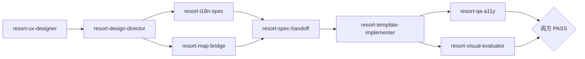

# 周辺エリアマップ — BKKDW ベンチマーク実装 指示書

> **目的**: [BKK Design Week 2026 — Coffee Ground Zero](https://bkkdw26.greydientlab.com/) の Organic Drop-off マップをベンチマークに、美瑛 LP モックの周辺マップ（`docs/mock-assets/area-map.html`）を **見やすい全体俯瞰 + ピンタップポップアップ** UX に刷新する。  
> **層**: L1 spec → handoff → L2 実装 → L3 評価  
> **対象外**: 七戸 `/map` リフトマップ艦隊（`map-*`）、ルート `src/` 本番 UI

---

## 0. ベンチマーク要約（BKKDW）

参照: [bkkdw26.greydientlab.com](https://bkkdw26.greydientlab.com/) — 「Organic Drop-off」セクション

| 観点 | BKKDW の挙動 | 本プロジェクトでの採用 |
|------|----------------|------------------------|
| **画面比率** | 地図がセクションの主役。上下に太いフレーム、地図タイルは淡色・低彩度 | 地図ステージを **横幅・高さとも最大**（デスクトップ: 左 65–75% / モバイル: 地図フル幅・縦優先） |
| **初期縮尺** | 全ピンが一度に見えるズーム（都市全体俯瞰） | `fitBounds(visiblePins)` を **初期表示・レイヤ切替後** のデフォルト。個別選択で過度にズームインしない |
| **ピン** | 黒丸 + 中央アクセントドット。カテゴリ別アイコンなし | **シンプルな統一ピン**（黒 or `--area-text` 円 + アクセントドット）。既存カテゴリ別 PNG は **v2 では使わない**（オプションで v3 復帰可） |
| **タップ挙動** | ピンクリック → **地図上** に黒ポップアップ | Leaflet `Popup` / カスタムオーバーレイを **地図キャンバス上** に表示。サイドバー詳細は補助（リスト連動のみ） |
| **ポップアップ内容** | 名前 / 種別 / 地区 / 電話 / **VIEW MAP →** | 名前 / カテゴリ（パン屋・カフェ・温泉等） / 地区（任意） / 電話 / 公式サイト（あれば） / **View Map →** |
| **View Map** | 外部 Google Maps へ | `https://www.google.com/maps/search/?api=1&query=` + 座標 or `mapsQuery` |
| **モバイル** | 地図フル幅、ポップアップはピン直上、操作は最小 | embed / スタンドアロン両方で **地図優先**。リストは FAB または下部シート（既存 embed パターンを BKKDW 寄せに整理） |
| **フィルタ** | 地区タブ（All Districts） | 既存レイヤ（飲食 / 温泉 / 拠点）を維持。切替後も **全体俯瞰を維持** |

### 配色方針（コピーしない）

BKKDW のネオンイエロー + 黒は **そのままコピーしない**。美瑛モックの既存トークン（`--area-accent`, `#5a6f85` 等）または Alpine Clarity 系で **同等のコントラスト** を確保する。

---

## 1. 現状ギャップ

| 項目 | 現状 (`area-map.js`) | 目標 |
|------|----------------------|------|
| 詳細表示 | 右レール `.area-detail` のみ | **地図上ポップアップ** が主。レールはリスト選択のミラー |
| 選択時ズーム | `flyTo` + `selectionZoom` で寄る | **全体俯瞰維持**（ポップアップが画面外なら最小パンのみ） |
| POI データ | `label`, `category`, `mapsQuery` のみ | `phone`, `website`, `district`（任意）を追加 |
| ピン | カテゴリ別 PNG（32/48） | BKKDW 型 **統一ドットピン** |
| デスクトップレイアウト | 地図 + 右レール 50:50 相当 | **地図 70% / レール 30%**（BKKDW の地図主役） |
| ポップアップ CTA | 「Google Mapで開く」リンクのみ | **VIEW MAP →** ボタン（全幅・高コントラスト） |

---

## 2. データ契約（POI スキーマ拡張）

**担当**: L1 `resort-map-bridge`（周辺 POI 専用スコープ）→ handoff で凍結

```jsonc
{
  "id": "junpei",
  "group": "food",
  "category": "western",          // 既存キー → i18n ラベル
  "lat": 43.5893234,
  "lon": 142.4681529,
  "label": { "ja": "…", "en": "…" },
  "shortLabel": { "ja": "…", "en": "…" },
  "mapsQuery": "…",               // Google Maps 検索クエリ（既存）
  "phone": "0166-XX-XXXX",        // 任意。なければ行非表示
  "website": "https://…",         // 任意。なければ行非表示
  "district": { "ja": "美瑛町", "en": "Biei" }  // 任意
}
```

- `phone` / `website` は **公開情報のみ**。不明な POI はフィールド省略可（モックは代表 3 件にサンプル追加、残りは省略）。
- `category` → UI 表示名は `area-map.js` の `UI.category.*` を使用（パン屋 / カフェ / 温泉 等）。

---

## 3. インタラクション spec（L1 確定事項）

### 3.1 状態遷移

```
[初期]
  → fitBounds(表示中全ピン) + padding
  → ポップアップなし

[ピン click / リスト click]
  → selectedId 更新
  → 地図上にポップアップ open（Leaflet bindPopup または L.popup）
  → 選択ピンを z-index 前面 + ドット拡大（任意）
  → ズームは原則変更しない（popup が clip される場合のみ panTo）

[地図空白 click / Esc]
  → ポップアップ close + selectedId null

[レイヤ切替]
  → fitBounds(新しい visible 集合)
  → ポップアップ close
```

### 3.2 ポップアップ DOM 構造（例）

```html
<div class="area-map-popup" role="dialog" aria-labelledby="popup-title-{id}">
  <h3 id="popup-title-{id}">洋食とCafe じゅんぺい</h3>
  <p class="area-map-popup__category">洋食 · カフェ</p>
  <p class="area-map-popup__district">美瑛町</p>
  <a class="area-map-popup__phone" href="tel:…">0166-…</a>
  <a class="area-map-popup__web" href="…" target="_blank" rel="noopener">公式サイト ↗</a>
  <a class="area-map-popup__cta" href="https://www.google.com/maps/…">VIEW MAP →</a>
</div>
```

- `phone` / `website` / `district` が無い場合は **要素ごと非表示**（空行を出さない）。
- CTA は BKKDW 同様 **ボタン風・全幅**。キーボードフォーカス可能。

### 3.3 禁止（七戸 `/map` ルールとの関係）

- 本件は **周辺 POI マップ**（Leaflet + OSM）であり、リフトマップ艦隊の対象外。
- リスト選択で **地図を覆う bottom sheet / 全画面モーダル** は禁止（ポップアップはピン近傍の小さなカード）。
- 根拠のない座標追加は禁止（既存 `source` フィールドを維持）。

---

## 4. レイアウト・レスポンシブ（BKKDW 参考）

| ブレークポイント | 地図 | レール / リスト | ポップアップ |
|------------------|------|-----------------|--------------|
| **≥1024px** | `flex: 1 1 72%`, min-height `min(72vh, 720px)` | 右 28%、スクロールリスト + 簡易詳細 | ピン上 ~280px 幅 |
| **768–1023px** | 上 60% | 下 40% リスト | ピン上、画面端で flip |
| **≤767px スタンドアロン** | 上 55–65dvh | 下リスト | ピン上、CTA 44px 高 |
| **≤767px embed** | 100% 高（LP iframe） | FAB → 下部シート（既存） | ピン上。FAB と重ならない offset |

- 地図タイル: CartoDB Positron 等 **淡色ベース**（BKKDW の低彩度に近づける）。OSM 標準タイルは v2 から変更可。
- 地図外枠: 2–4px のアクセントボーダー + 角丸（BKKDW の黄フレームの **構造のみ** 参考）。

---

## 5. エージェント分担

### パイプライン（順序固定）



| 順 | エージェント | 層 | 成果物 | コード |
|----|-------------|-----|--------|--------|
| 1 | `resort-ux-designer` | L1 | `docs/mock-assets/area_map_ux_spec.md` | 書かない |
| 2 | `resort-design-director` | L1 | `docs/mock-assets/area_map_requirements.md` | 書かない |
| 3 | `resort-i18n-spec` | L1 | `docs/mock-assets/area_map_i18n.md` | 書かない |
| 4 | `resort-map-bridge` | L1 | `docs/mock-assets/area_map_data_contract.md` | 書かない |
| 5 | `resort-spec-handoff` | L1→L2 | `docs/mock-assets/area_map_handoff_checklist.md` | 書かない |
| 6 | `resort-template-implementer` | L2 | 下表「実装ファイル」 | **書く** |
| 7 | `resort-qa-a11y` | L3 | `docs/mock-assets/area_map_qa_report.md` | 書かない |
| 8 | `resort-visual-evaluator` | L3 | `docs/mock-assets/area_map_qa_visual.md` | 書かない |

**七戸 `map-*` 艦隊は起動しない**（リフト線・SVG オーバーレイなし）。

### L2 実装ファイル（implementer）

| パス | 内容 |
|------|------|
| `docs/mock-assets/_shared/area-map.js` | ポップアップ、fitBounds 方針、統一ピン、選択状態 |
| `docs/mock-assets/_shared/area-map.css` | BKKDW 型レイアウト・ポップアップ・ピン・モバイル |
| `docs/mock-assets/area-map.html` | 必要なら構造調整（ポップアップ用テンプレート容器） |
| `docs/mock-assets/data/maps/biei-area.json` | `phone` / `website` / `district` サンプル追加 |
| `docs/mock-assets/_shared/icons/` | 統一ドットピン SVG/PNG（新規 `marker-poi-dot-32/48`） |

---

## 6. 各エージェントへの依頼文（コピペ用）

### 6.1 resort-ux-designer

```
@resort-ux-designer
ベンチマーク: https://bkkdw26.greydientlab.com/ Organic Drop-off マップ
入力: docs/mock-assets/AREA_MAP_BKKDW_AGENT_BRIEF.md
現状: docs/mock-assets/_shared/area-map.js, area-map.css, area-map.html

BKKDW を参考に、周辺 POI マップの UX を 3 案 → 比較表で docs/mock-assets/area_map_ux_spec.md に出力。
必須: 全体俯瞰縮尺、統一ドットピン、地図上ポップアップ（名前/種別/電話/公式/View Map）、
デスクトップ・モバイル・embed の画面比率。七戸 /map とは別物と明記。
```

### 6.2 resort-design-director

```
@resort-design-director
入力: docs/mock-assets/area_map_ux_spec.md, AREA_MAP_BKKDW_AGENT_BRIEF.md
Self-Critique 後、1 案に確定して docs/mock-assets/area_map_requirements.md を書く。
V1–V5 受け入れ基準（ポップアップ可読性、地図 70% ルール、CTA 44px、淡色タイル）を含める。
```

### 6.3 resort-i18n-spec

```
@resort-i18n-spec
入力: area_map_requirements.md
ポップアップ文言（VIEW MAP → / 地図で開く →、公式サイト、電話、カテゴリ表示）の ja/en 表を
docs/mock-assets/area_map_i18n.md に。area-map.js の UI オブジェクトキー名も提案。
```

### 6.4 resort-map-bridge

```
@resort-map-bridge
スコープ: 周辺 POI マップ（docs/mock-assets）のみ。七戸 /map 座標は触らない。
AREA_MAP_BKKDW_AGENT_BRIEF.md §2 を正式な data contract として
docs/mock-assets/area_map_data_contract.md に展開（必須/任意フィールド、Google Maps URL 規則）。
```

### 6.5 resort-spec-handoff

```
@resort-spec-handoff
入力: area_map_requirements.md, area_map_i18n.md, area_map_data_contract.md
L2 向け docs/mock-assets/area_map_handoff_checklist.md を作成（ファイル一覧、トークン、禁止事項、完了条件）。
```

### 6.6 resort-template-implementer

```
@resort-template-implementer
docs/mock-assets/area_map_handoff_checklist.md に従い BKKDW 型周辺マップを実装。
Leaflet 既存構成を維持。ピン click → 地図上ポップアップ。初期・レイヤ切替は fitBounds 全体俯瞰。
統一ドットピンに差し替え。biei-area.json に phone/website サンプル追加。
確認: npx serve docs/mock-assets -p 3456 → area-map.html?resort=biei
```

### 6.7 resort-qa-a11y + resort-visual-evaluator

```
@resort-qa-a11y
@resort-visual-evaluator
対象: docs/mock-assets/area-map.html（スタンドアロン + ?embed=1）
基準: area_map_requirements.md
出力: area_map_qa_report.md / area_map_qa_visual.md
375px・キーボード・ポップアップ focus trap 不要（Esc で閉じる）・コントラスト。
```

---

## 7. 受け入れ基準（Director が requirements に転記）

### 機能

- [ ] 初回表示で **表示中すべてのピン** が viewport に収まる
- [ ] レイヤ切替後も fitBounds（過度なズームインなし）
- [ ] ピンタップで **地図上** にポップアップ（名前・カテゴリ必須）
- [ ] 電話・公式サイトはデータがある場合のみ表示
- [ ] **VIEW MAP →** で Google Maps が新規タブで開く
- [ ] リスト選択とピン選択が **同期**（双方向）
- [ ] 空白タップ / Esc でポップアップ閉じる

### UX / ビジュアル

- [ ] デスクトップで地図が画面の **≥65%** を占める
- [ ] モバイル embed で地図が **フル高**、リストは FAB 経由
- [ ] ピンは **統一ドット**（BKKDW 型。カテゴリ別 PNG に戻さない）
- [ ] ポップアップ CTA は **44px 以上** タッチターゲット
- [ ] 地図タイルは淡色（標準 OSM のまま出荷不可 — Director 判断）

### a11y

- [ ] ポップアップ `role="dialog"` + `aria-labelledby`
- [ ] フォーカス可視、CTA に `aria-label`（i18n）
- [ ] `prefers-reduced-motion` で flyTo 無効（現行維持）

### データ

- [ ] `biei-area.json` schemaVersion 更新、後方互換（phone/website 省略可）
- [ ] 代表 POI 3 件以上に phone または website のサンプル

---

## 8. 検証手順

```bash
npx serve docs/mock-assets -p 3456
```

| URL | 確認内容 |
|-----|----------|
| `http://localhost:3456/area-map.html?resort=biei` | デスクトップ全体俯瞰 + ポップアップ |
| `…?resort=biei&layers=food,onsen,anchor` | 全レイヤ fitBounds |
| `…?embed=1` | LP 埋め込み・モバイル FAB |
| `biei-lp/nearby-food.html` | iframe embed 連携 |

---

## 9. 参考リンク

- [BKKDW 2026 — Coffee Ground Zero](https://bkkdw26.greydientlab.com/)（Organic Drop-off マップ UI）
- 現行実装: `docs/mock-assets/_shared/area-map.js`
- 現行データ: `docs/mock-assets/data/maps/biei-area.json`
- 七戸マップ艦隊: **対象外** — `resorts/Sichinohe-CyoueiSki/.cursor/agents/` の `map-*`

---

## 10. 起動コマンド（ユーザー向け）

**最短**: 実装まで一気に進める場合

```
@resort-ux-designer → @resort-design-director → @resort-i18n-spec と @resort-map-bridge（並列可）
→ @resort-spec-handoff → @resort-template-implementer
→ @resort-qa-a11y と @resort-visual-evaluator（並列）
```

**spec のみ**: 上記 L1 5 体まで。L2 は handoff 承認後。
